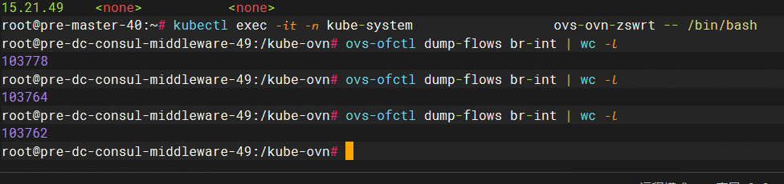
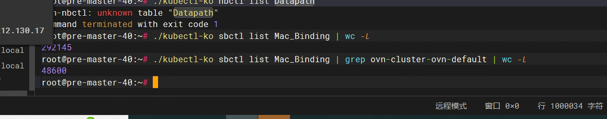
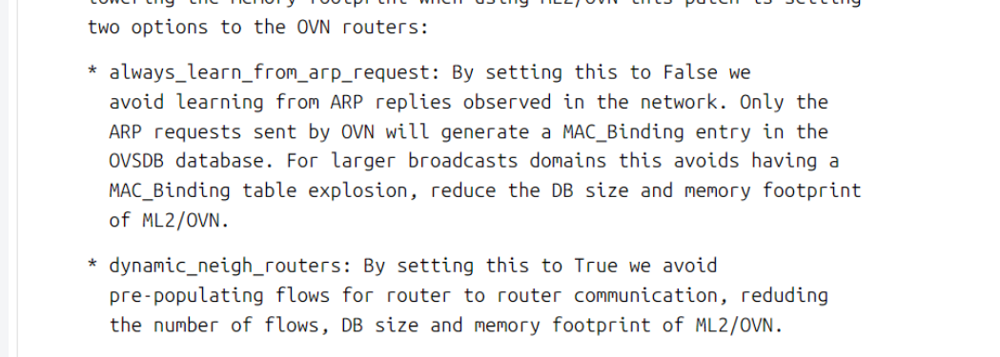
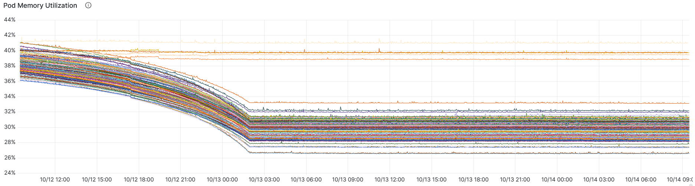
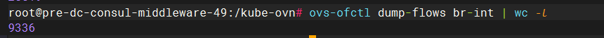

---kind:   - Troubleshootingproducts:    - Alauda Container Platform   - Alauda DevOps   - Alauda AI   - Alauda Application Services   - Alauda Service Mesh   - Alauda Developer PortalProductsVersion:   - 4.1.0,4.2.x---<!-- A type of document that involves encountering a fault, diag...it, performing root cause analysis, and providing solutions. --># ovsovs-ovn pod 内存占用偏高，导致网络性能下降丢包 流表数量过高（10w+） Mac_Binding 表中存在大量已删除 Pod 的记录（4.8w+条）## Cause- Service 后端 Pod 重建后遗留垃圾 Mac_Binding 表项- 每个 Mac_Binding 表项会产生 2 条 openflow 流表- 旧版本 Kube-OVN（1.9.27）缺乏自动清理机制## Resolution- kubectl ko nbctl set logical_router ovn-cluster options:always_learn_from_arp_request=false- kubectl ko nbctl set logical_router ovn-cluster options:dynamic_neigh_routers=true- 执行 delete-mac-binding.sh 脚本清理历史表项- 新版本可设置 mac_binding_age_threshold=300 自动老化清理## [workaround]- 手动执行清理脚本：./delete-mac-binding.sh "10.16."- 清理后重启 ovs-ovn pod## [Related Information]**Screenshots**- Environment: CNI 1.9.27- ovn-cluster- Mac_Binding- openflow- kubectl ko nbctl- logical_router options- sb db- Component: Kubernetes- Page ID: 237537907- Original Title: ovs-vswitched 由于Mac_Binding表导致内存泄漏