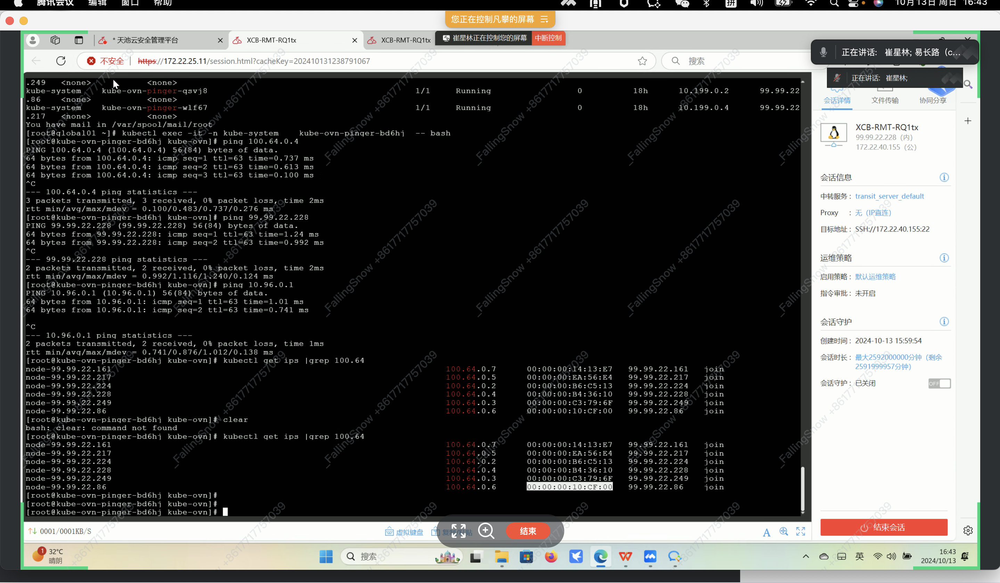

---
kind:
  - Troubleshooting
products:
  - Alauda Container Platform
  - Alauda DevOps
  - Alauda AI
  - Alauda Application Services
  - Alauda Service Mesh
  - Alauda Developer Portal
ProductsVersion:
  - 4.1.0,4.2.x
---
<!-- A type of document that involves encountering a fault, diagnosing it, performing root cause analysis, and providing solutions. -->

# kube

pod 到节点的网络不通

## Cause
- 清理db后join子网的lsp无法自动恢复

## Resolution
- 通过`kubectl get ips`获取join子网ip
- 执行`ovn-nbctl lsp-add join node-192.168.140.12`和`ovn-nbctl lsp-set-addresses node-192.168.140.12 "{$mac} ${ip}"`手动创建lsp

## [workaround]

## [Related Information]
**Screenshots**

- Environment: CNI 版本：1.3.0
- ovn-nbctl
- join子网
- logical_switch_port
- kubectl get ips
- Component: kube-ovn
- Page ID: 238519277
- Original Title: kube-ovn 1.3.0 清理db后恢复
