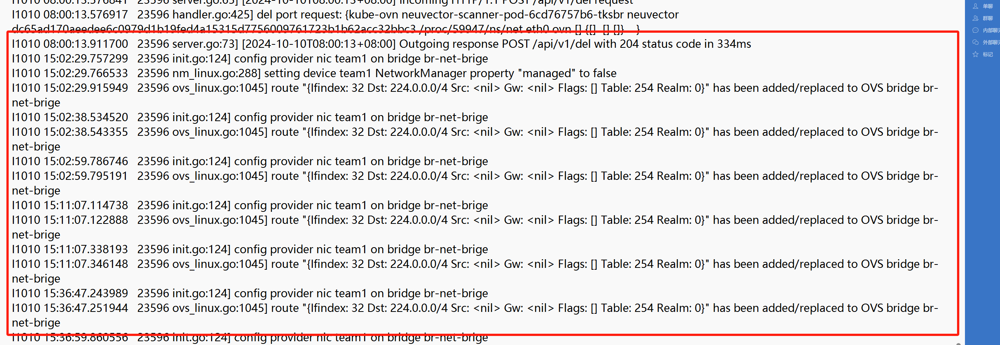
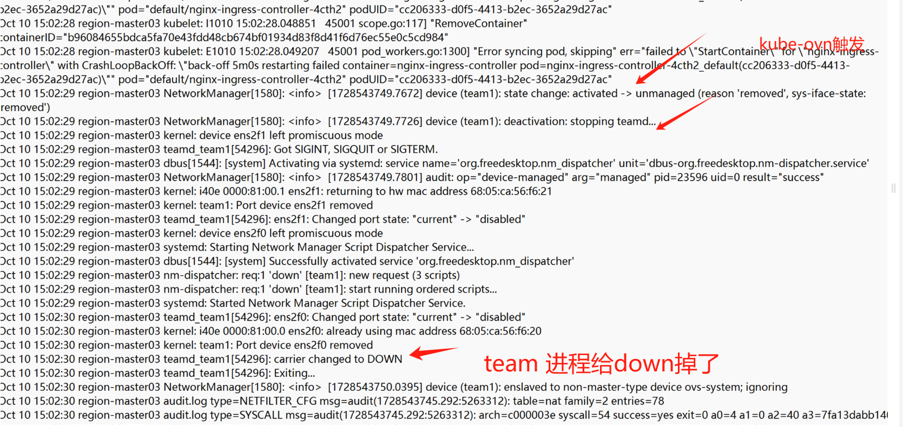
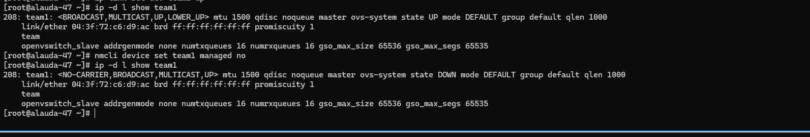

---kind:   - Troubleshootingproducts:    - Alauda Container Platform   - Alauda DevOps   - Alauda AI   - Alauda Application Services   - Alauda Service Mesh   - Alauda Developer PortalProductsVersion:   - 4.1.0,4.2.x---<!-- A type of document that involves encountering a fault, diag...it, performing root cause analysis, and providing solutions. --># 数研所POC环境添加节点后所有节点的underlay物理网卡down掉 kube-ovn-cni日志显示设置team1的NetworkManager属性"managed"为false team进程导致网卡down## Cause- kube-ovn-cni初始化时将team网卡的NetworkManager属性"managed"设为false- team网卡被设为unmanaged后，NetworkManager停止管理导致team进程关闭网卡## Resolution- 提交PR，检查到team网卡时不执行NetworkManager unmanaged操作（https://github.com/kubeovn/kube-ovn/pull/4629）## [workaround]- 关闭NetworkManager服务## [Related Information]**Screenshots**- Environment: CNI 1.12.14- kube-ovn-cni- NetworkManager- team网卡配置- managed属性- Component: kube-ovn- Page ID: 238519287- Original Title: 数研所POC环境-添加业务集群节点触发业务网卡down