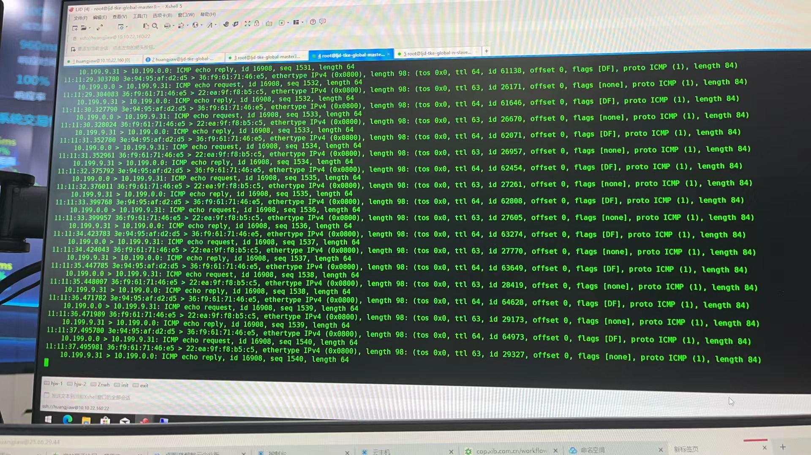
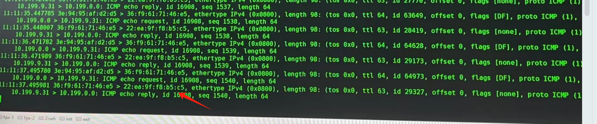
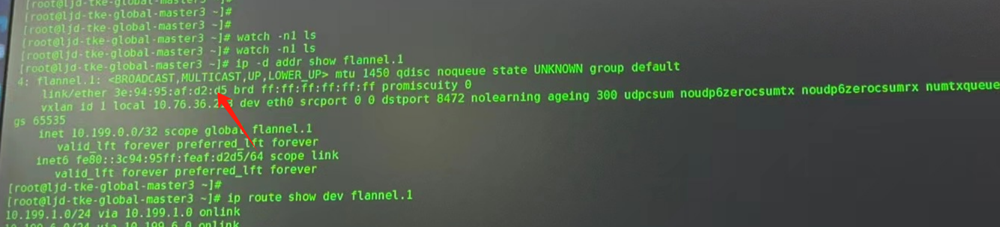
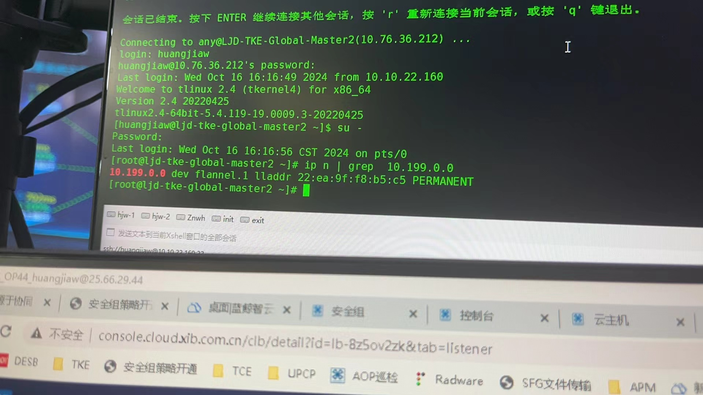

---kind:   - Troubleshootingproducts:    - Alauda Container Platform   - Alauda DevOps   - Alauda AI   - Alauda Application Services   - Alauda Service Mesh   - Alauda Developer PortalProductsVersion:   - 4.1.0,4.2.x---<!-- A type of document that involves encountering a fault, diag...it, performing root cause analysis, and providing solutions. --># 厦门国际 Flannel 节点重启后，节点上ping其他节点pod不通。pod访问重启后的master节点api-server不通 从master3节点ping其他节点pod不通 icmp reply的mac与flannel.1网卡mac不匹配## Cause- systemd覆盖flannel.x网卡的mac地址## Resolution- 创建/etc/systemd/network/50-flannel.link文件- 文件内容：[Match]
OriginalName=flannel*
[Link]
MACAddressPolicy=none- 重启系统## [workaround]- 重启其他所有节点的flanneld pod## [Related Information]**Screenshots**- flannel.1- iptables- arp/fdb- flanneld pod- /etc/systemd/network/50-flannel.link- Component: Kubernetes- Page ID: 240812854- Original Title: 厦门国际 Flannel 节点重启后，节点上ping其他节点pod不通。