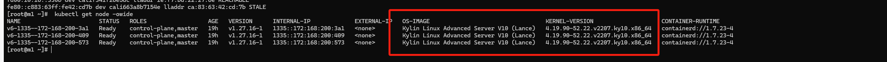
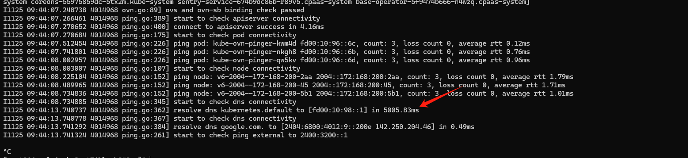
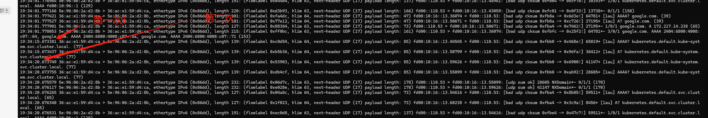
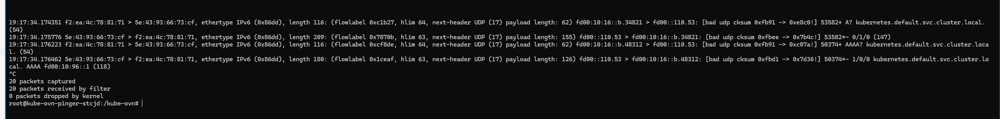
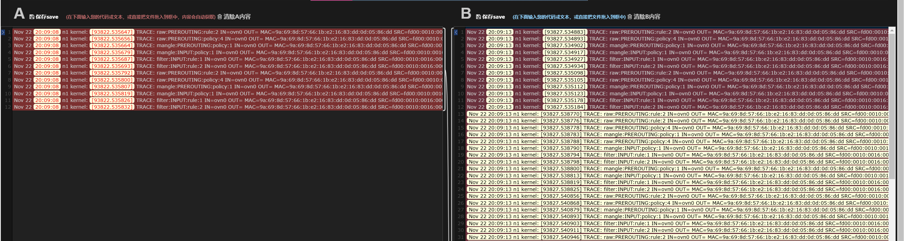
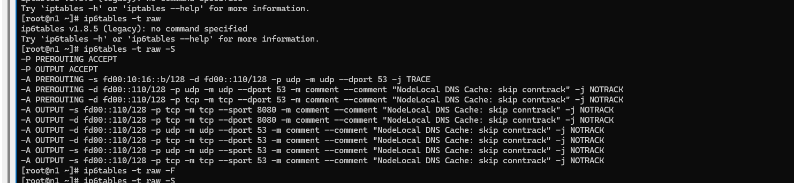

---
kind:
  - Troubleshooting
products:
  - Alauda Container Platform
  - Alauda DevOps
  - Alauda AI
  - Alauda Application Services
  - Alauda Service Mesh
  - Alauda Developer Portal
ProductsVersion:
  - 4.1.0,4.2.x
---
<!-- A type of document that involves encountering a fault, diagnosing it, performing root cause analysis, and providing solutions. -->

# 麒麟sp3 ipv6 node

访问内部域名出现5s或10s超时 kube-ovn-pinger首次A/AAAA请求无响应，5s后重试成功 nslookup工具查询正常无超时

## Cause
- kube-ovn 1.12版本缺少conntrack规则patch导致规则冲突
- 麒麟4.19内核可能存在的conntrack zone隔离缺陷

## Resolution
- 合并kube-ovn补丁：https://github.com/kubeovn/kube-ovn/pull/4762

## [workaround]
- 修改node-local-dns DaemonSet参数：
args增加"-setupiptables=false"

## [Related Information]
**Screenshots**

- Environment: Kylin SP3 (4.19.90-52.22.v2207.ky10.x86_64) + Kube-OVN v1.12.28 + ACP 3.18.1
- kube-ovn
- node-local-dns
- iptables
- conntrack
- ovn0网卡
- Component: kube-ovn
- Page ID: 247496759
- Original Title: 麒麟sp3 ipv6 node-local-dns 出现5s 超时
