---kind:   - Troubleshootingproducts:    - Alauda Container Platform   - Alauda DevOps   - Alauda AI   - Alauda Application Services   - Alauda Service Mesh   - Alauda Developer PortalProductsVersion:   - 4.1.0,4.2.x---<!-- A type of document that involves encountering a fault, diag...it, performing root cause analysis, and providing solutions. --># 郑州银行，3.12.3underlay 集群，节点访问pod 偶现延迟很高节点访问同节点上的容器偶现延迟很高 ovs-vswitchd 进程 CPU 占用突增 ovs-vswitchd 日志出现大量 WARN 级别告警## Cause- ovs-vswitchd 进程 CPU 资源争用导致报文处理延迟- fdb 转发表频繁刷新可能引发广播风暴或资源竞争- 交换机 VLAN 配置未完全优化(原 allow all)## Resolution- 排查节点 CPU 使用情况并优化资源分配- 调整交换机配置仅允许指定 VLAN 通过## [workaround]- 优化交换机 VLAN 配置: interface GigabitEthernet1/0/1
 port link-type trunk
 port trunk allow-pass vlan 167## [Related Information]**Screenshots**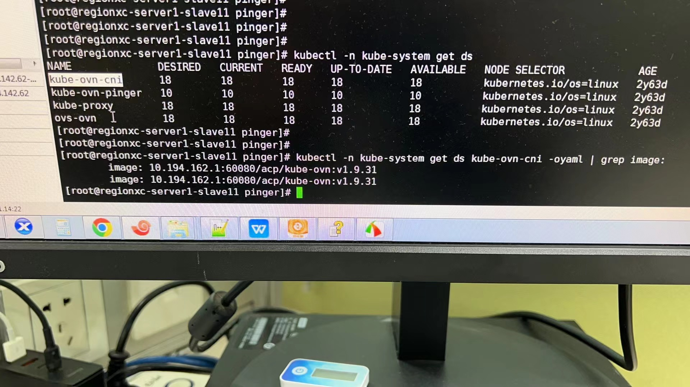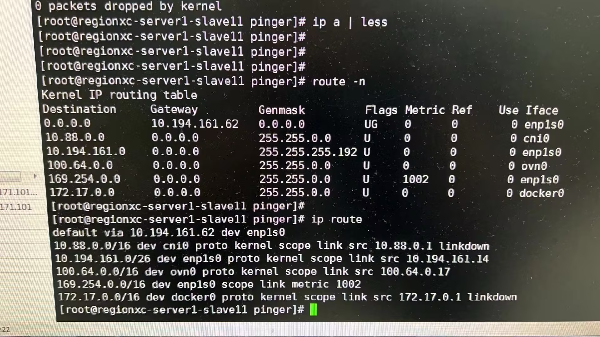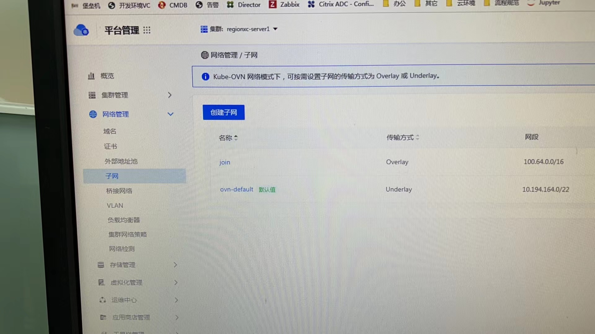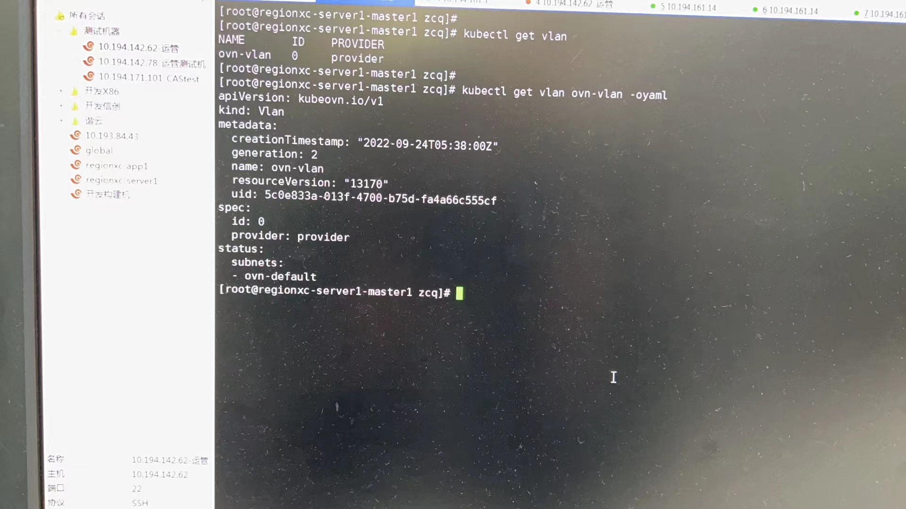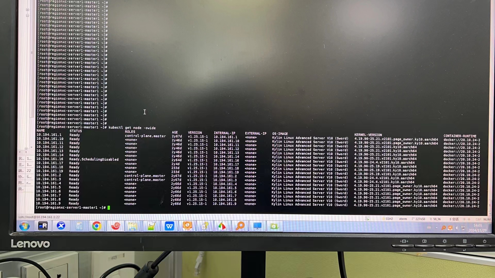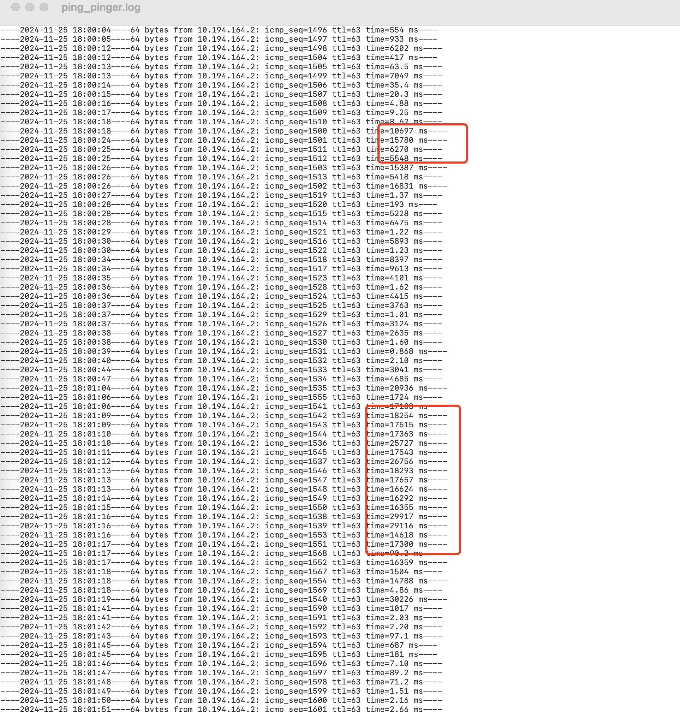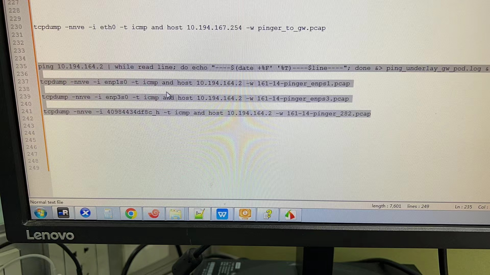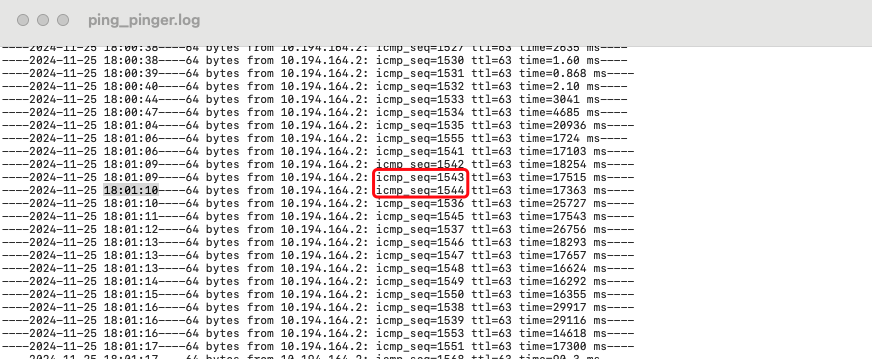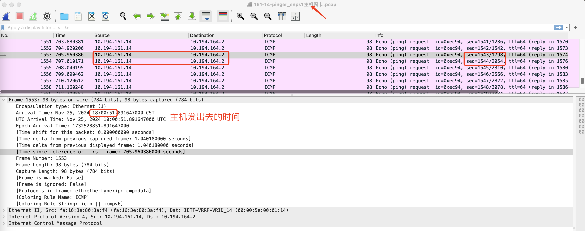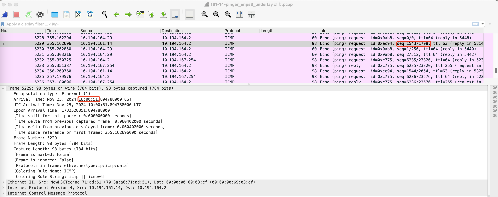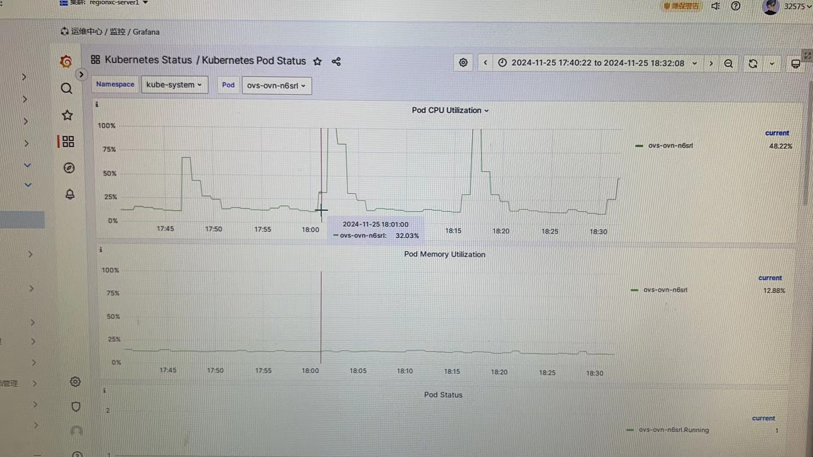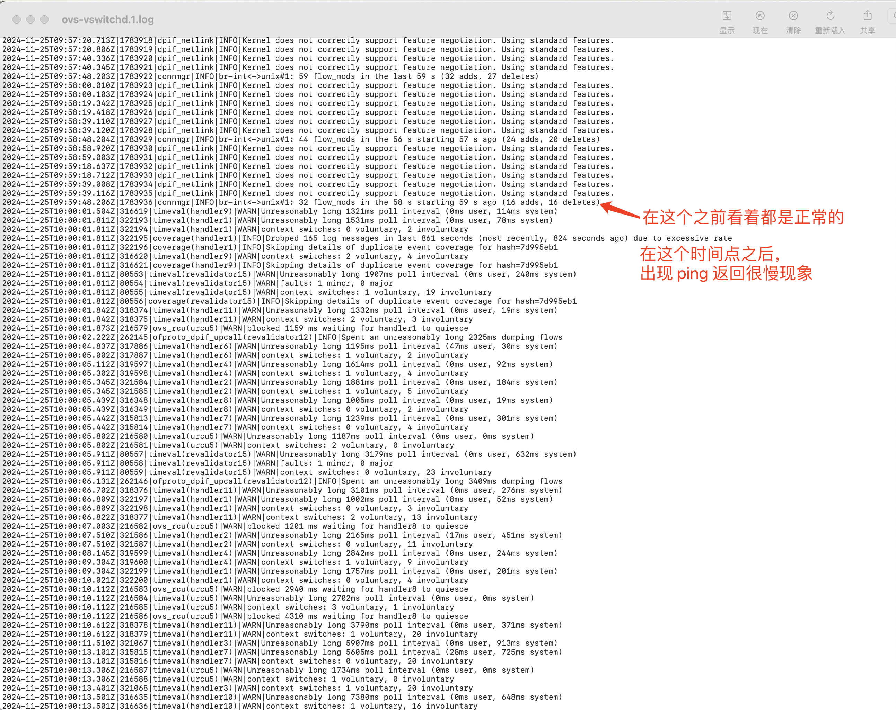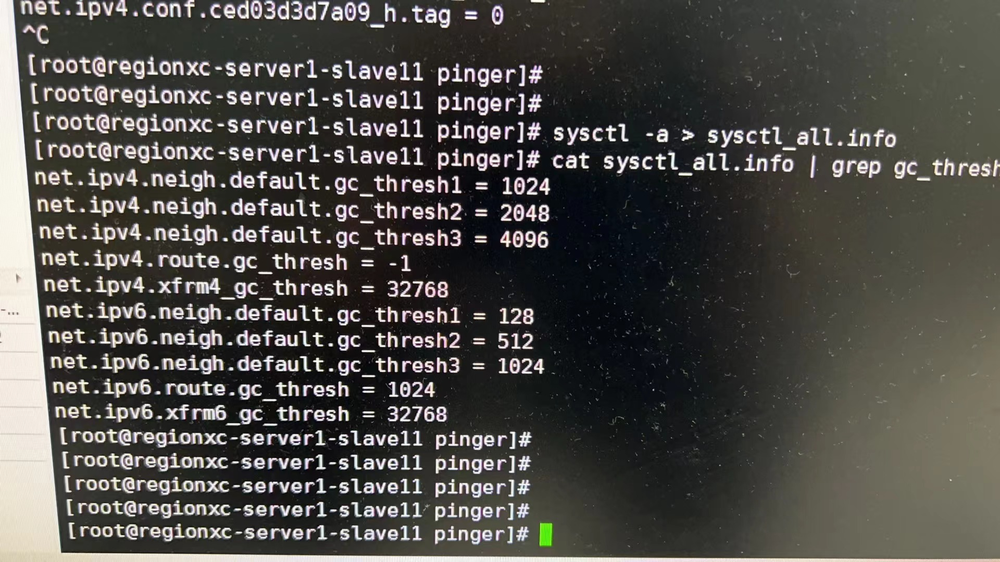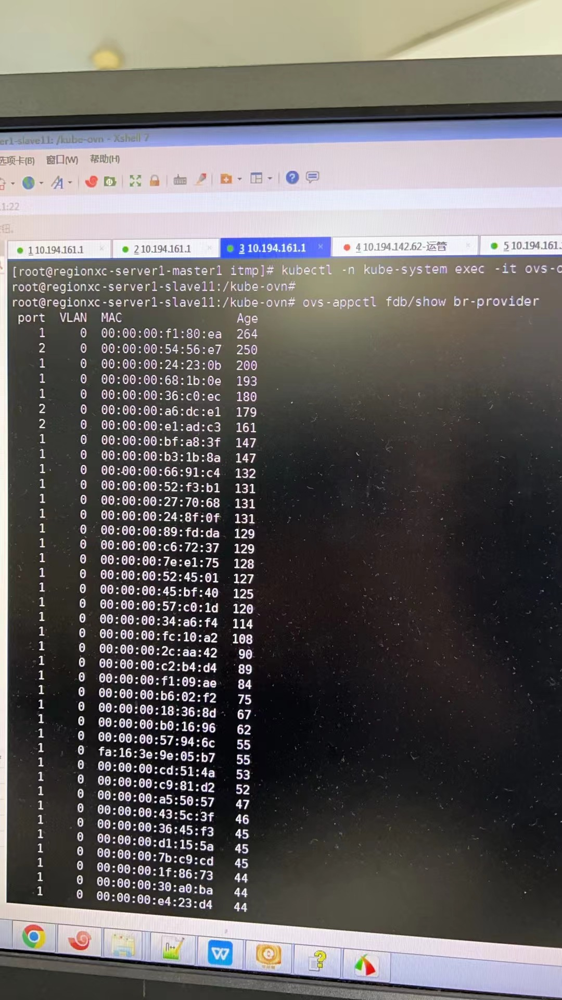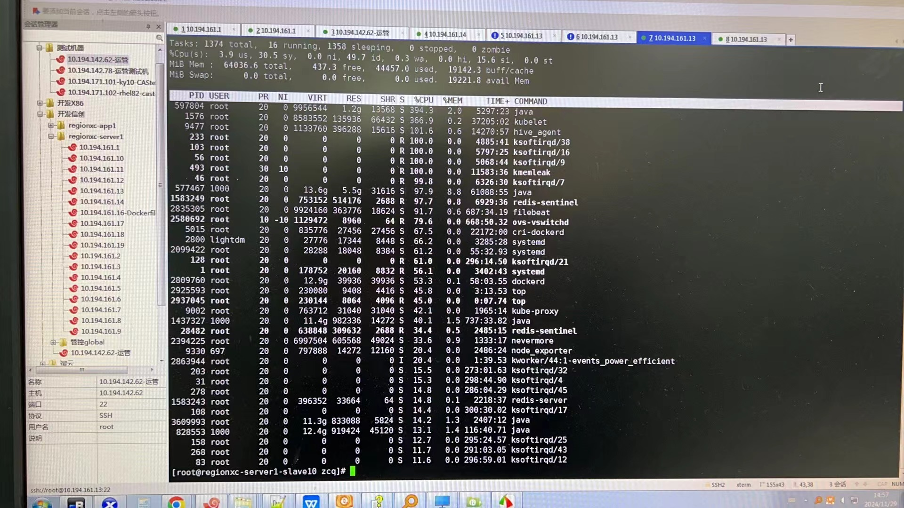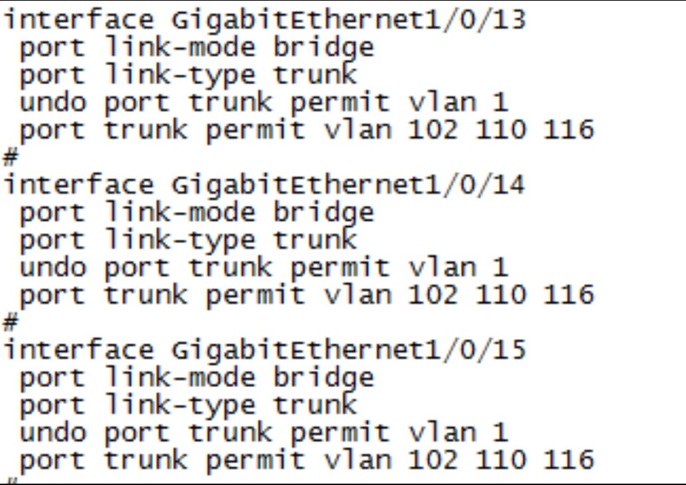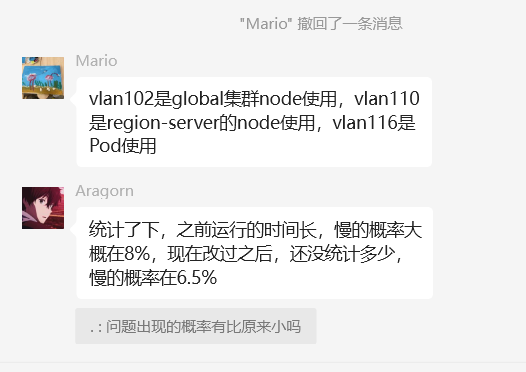- Environment: Kylin 10 (4.19.90-25.21.v2101.ky10.aarch64), Kube-OVN 1.9.35, ACP 3.12.3, ARM 架构- Kube-OVN 1.9.35- ovs-vswitchd- ovn-controller- enp3s0- VLAN 167- fdb 转发表- Component: Kubernetes- Page ID: 248643842- Original Title: 郑州银行，3.12.3underlay 集群，节点访问pod 偶现延迟很高