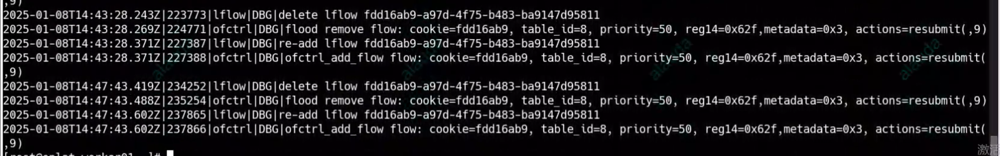
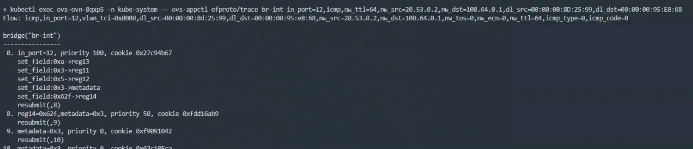

---kind:   - Troubleshootingproducts:    - Alauda Container Platform   - Alauda DevOps   - Alauda AI   - Alauda Application Services   - Alauda Service Mesh   - Alauda Developer PortalProductsVersion:   - 4.1.0,4.2.x---<!-- A type of document that involves encountering a fault, diag...it, performing root cause analysis, and providing solutions. --># 国产海光CPU虚拟机平台性能异常，导致进程占用CPU高，OVS 流表缺失业务 Pod 无法正常启动 业务 Pod 无法访问集群外的数据库 主网关节点 ovs-ovn CPU 达到 100%## Cause- ovn-controller 因 CPU 打满导致 inactivity 断开连接- 虚拟机平台 CPU 性能异常导致进程高 CPU 占用## Resolution- 手动重启 ovn-controller 并开启 dbg 日志## [workaround]- 执行虚拟机热迁移临时恢复## [Related Information]**Screenshots**- Environment: 内核：4.19.90-23.51.v2101.ky10.x86_64, CNI: Kube-OVN v1.9, 国产海光 CPU 虚拟机- OVS 流表- ovn-controller- Kube-OVN- ARP- kubelet- containerd- Component: kube-Ovn- Page ID: 257263084- Original Title: 国产海光CPU虚拟机平台性能异常，导致进程占用CPU高，OVS 流表缺失