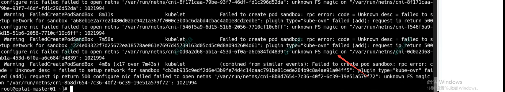
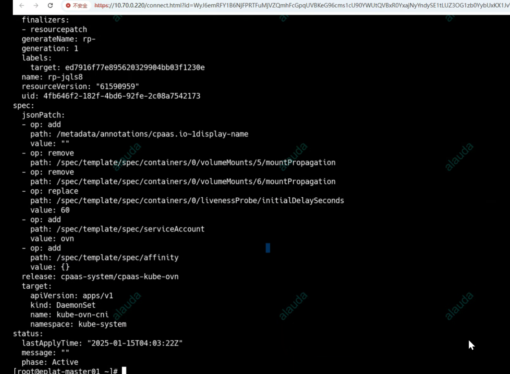

---kind:   - Troubleshootingproducts:    - Alauda Container Platform   - Alauda DevOps   - Alauda AI   - Alauda Application Services   - Alauda Service Mesh   - Alauda Developer PortalProductsVersion:   - 4.1.0,4.2.x---<!-- A type of document that involves encountering a fault, diag...it, performing root cause analysis, and providing solutions. --># 宝信 所有启动的pod报 unknown FS magic所有启动的pod报unknown FS magic错误## Cause- kube-ovn-cni组件被错误配置了resourcePatch参数## Resolution- 删除kube-ovn-cni相关的resourcePatch配置## [workaround]## [Related Information]**Screenshots**- Environment: CNI:kubeovn 1.9.33- kube-ovn-cni- resourcePatch- Component: Kubernetes- Page ID: 258476183- Original Title: 宝信 所有启动的pod报 unknown FS magic