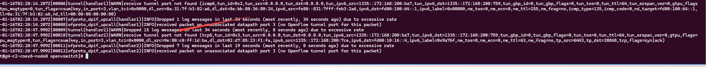
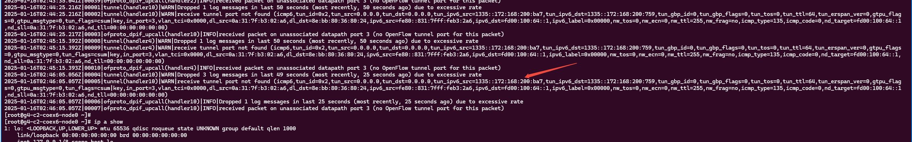
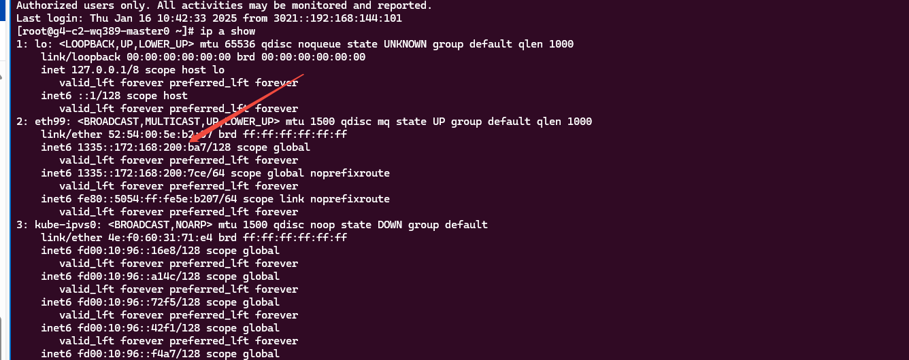
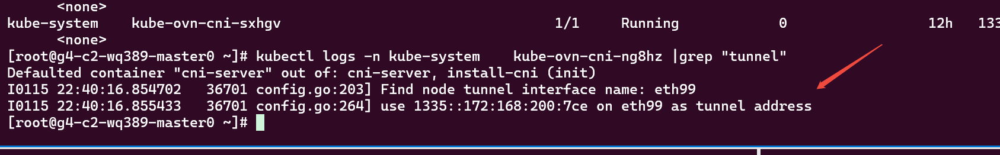
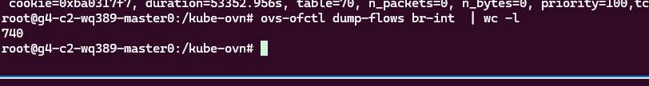
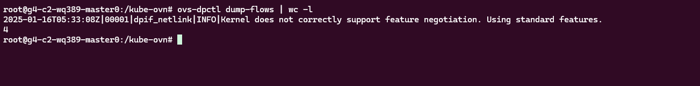
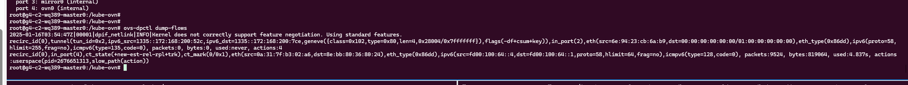
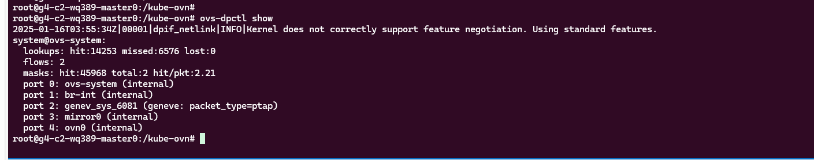
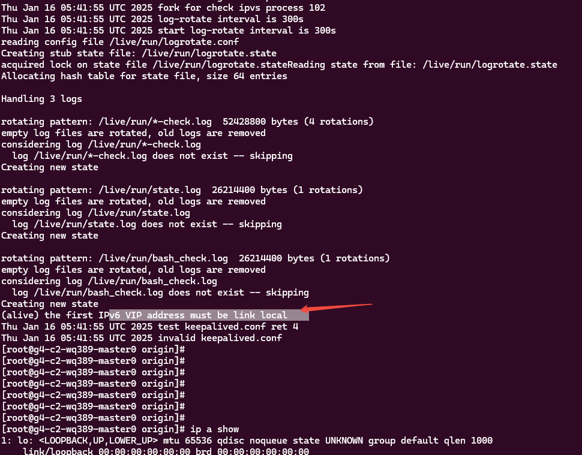
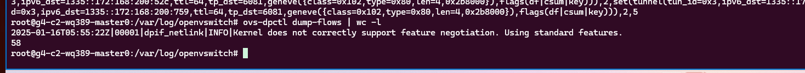

---kind:   - Troubleshootingproducts:    - Alauda Container Platform   - Alauda DevOps   - Alauda AI   - Alauda Application Services   - Alauda Service Mesh   - Alauda Developer PortalProductsVersion:   - 4.1.0,4.2.x---<!-- A type of document that involves encountering a fault, diag...it, performing root cause analysis, and providing solutions. --># 每日发版麒麟 receive tunnel port not foundkube-ovn-pinger 起不来 访问api-server不通 ovs-vswitchd.log 出现 receive tunnel port not found## Cause- 主节点错误使用alive VIP作为tunnel源IP- 麒麟内核问题导致datapath流表未更新- 纯ipv6环境不支持alived VIP## Resolution- 手动删除管理网卡上的alive vip- 重启ovs-ovn服务## [workaround]## [Related Information]**Screenshots**- Environment: 麒麟 Linux 4.19.90-52.22.v2207.ky10.x86_64, kube-ovn overlay 1.12.26, 纯ipv6环境- kube-ovn-pinger- ovs-vswitchd- alived- conntrack- datapath流表- openflow流表- /etc/origin/ovn/ovn_nb- /etc/origin/ovn/ovn_sb- /etc/origin/ovn/conf.db- Component: kube-Ovn- Page ID: 258476718- Original Title: 每日发版麒麟 receive tunnel port not found