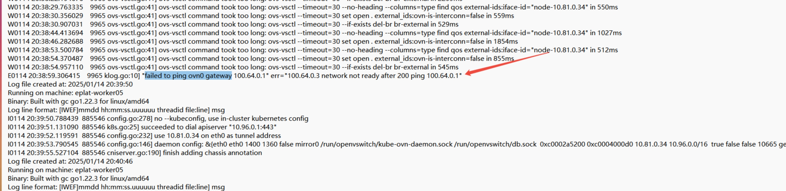
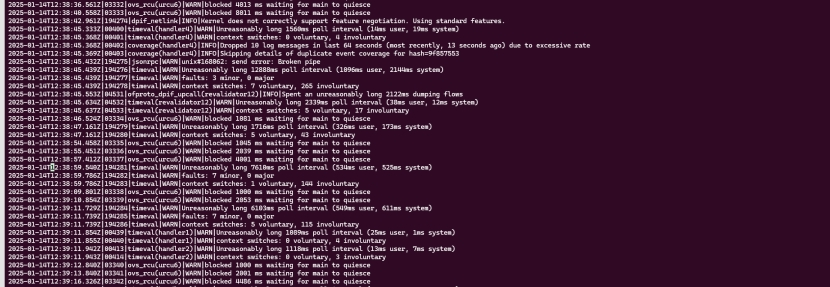
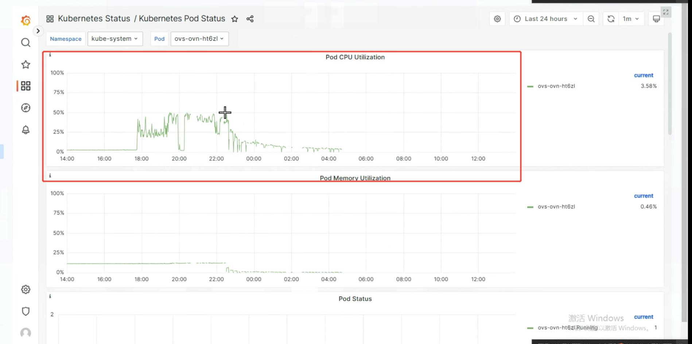

---kind:   - Troubleshootingproducts:    - Alauda Container Platform   - Alauda DevOps   - Alauda AI   - Alauda Application Services   - Alauda Service Mesh   - Alauda Developer PortalProductsVersion:   - 4.1.0,4.2.x---<!-- A type of document that involves encountering a fault, diag...it, performing root cause analysis, and providing solutions. --># 宝信流表丢失导致访问ovn0 不通cni起不来kube-ovn-cni 启动失败 访问 ovn0 不通 ovs-vswitchd 和 ovn-controller 出现高负载日志（unreasonably long poll、waiting for main to quiesce）## Cause- 高 CPU 负载导致 ovs-vswitchd 和 ovn-controller 处理异常- ovs-ovn 流表生成问题## Resolution- 重启 ovs-ovn## [workaround]## [Related Information]**Screenshots**- Environment: 操作系统: 麒麟, 内核: 麒麟sp1, CNI: overlay 1.9- ovs-ovn- ovn0- kube-ovn-cni- ovs-vswitchd- ovn-controller- Component: Kubernetes- Page ID: 260014644- Original Title: 宝信流表丢失导致访问ovn0 不通cni起不来