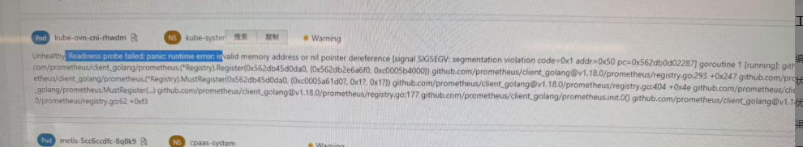
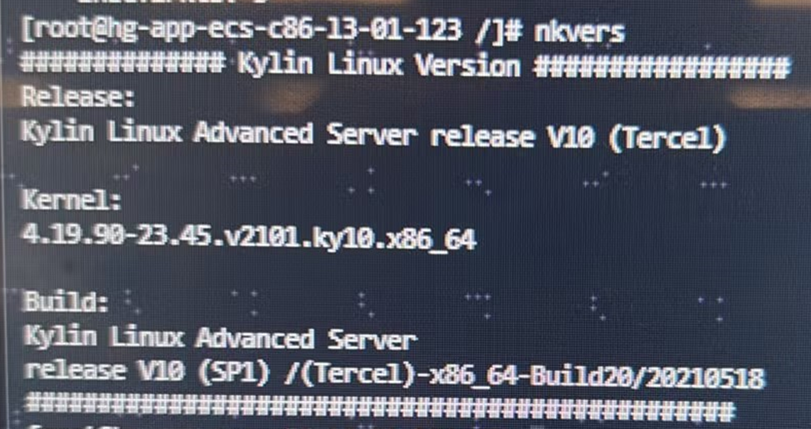

---kind:   - Troubleshootingproducts:    - Alauda Container Platform   - Alauda DevOps   - Alauda AI   - Alauda Application Services   - Alauda Service Mesh   - Alauda Developer PortalProductsVersion:   - 4.1.0,4.2.x---<!-- A type of document that involves encountering a fault, diag...it, performing root cause analysis, and providing solutions. --># 健康检查偶现失败健康检查偶现失败 空指针报错 超时错误## Cause- exec 健康检查方式在特定环境下偶发不稳定## Resolution- 将健康检查方式修改为 tcpSocket- 后续版本将改用 httpGet 方式## [workaround]- 临时将健康检查方式改为 tcpSocket（可能伴随 tls eof 错误，可忽略）## [Related Information]**Screenshots**- Environment: Kylin V10 SP1, ACP v3.16.2- kube-ovn-cni- metis- exec- tcpSocket- httpGet- prometheus/client_golang- Component: kube-ovn- Page ID: 264798277- Original Title: 健康检查偶现失败