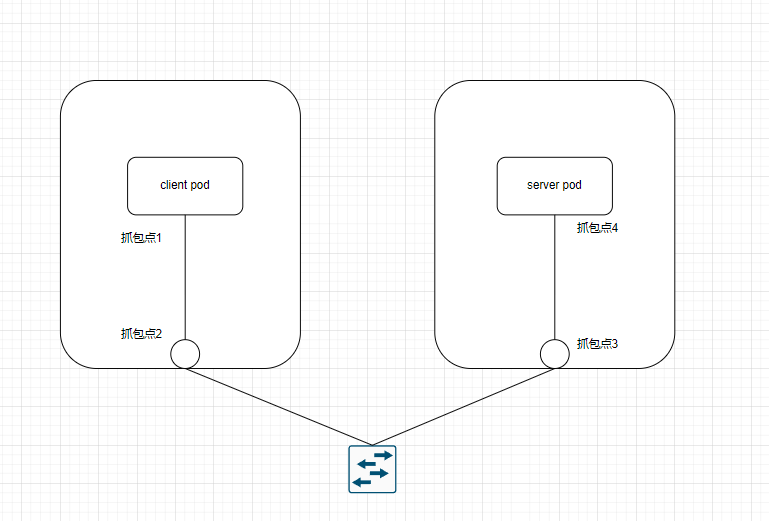
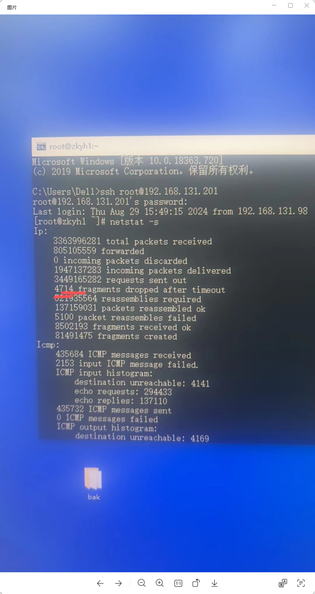
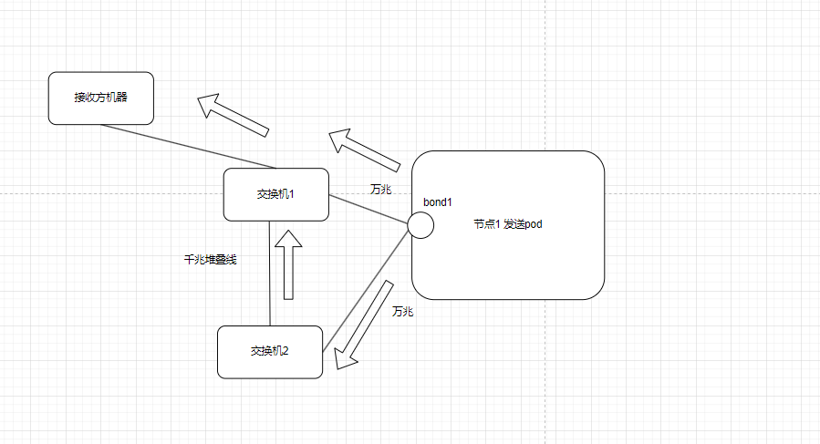
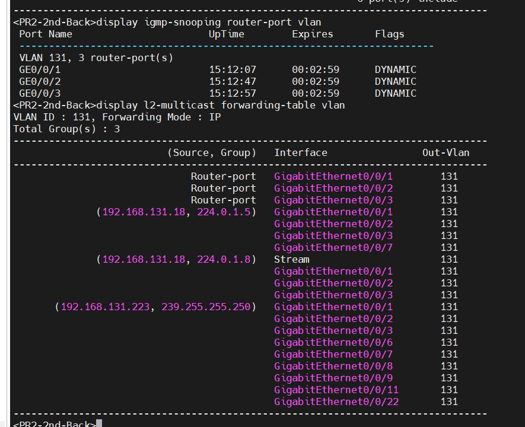

---kind:   - Troubleshootingproducts:    - Alauda Container Platform   - Alauda DevOps   - Alauda AI   - Alauda Application Services   - Alauda Service Mesh   - Alauda Developer PortalProductsVersion:   - 4.1.0,4.2.x---<!-- A type of document that involves encountering a fault, diag...it, performing root cause analysis, and providing solutions. --># 中科宇航组播 UDP 丢包client pod到server pod丢包，抓包点3和4差值最大 ifconfig显示eth0网卡丢包 交换机将组播报文泛洪到未加入组播的pod节点## Cause- tcpdump使用udp过滤导致仅捕获第一个分片，统计不准- 交换机间千兆堆叠线导致万兆流量转千兆时丢包- 组播转发表中端口被标记为Router-port，可能由OVN的IGMP查询机制引起## Resolution- 取消tcpdump的udp过滤以准确统计分片- 建议使用万兆堆叠线或LAG绑定万兆口- 检查交换机组播配置和转发表## [workaround]- 使用bond主备模式指定主网卡在交换机A## [Related Information]**Screenshots**- Environment: 万兆网卡，千兆堆叠线，Kube-OVN CNI- tcpdump -i xxx udp and host xxxx and port xxx- UDP分片- 交换机堆叠配置- multicast_snoop- IGMP查询- OVN路由器结构- Component: kube-ovn- Page ID: 266895440- Original Title: 中科宇航组播 UDP 丢包