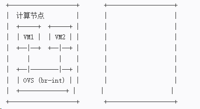
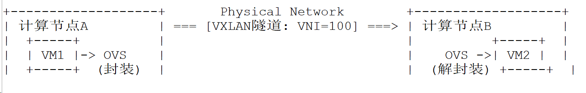
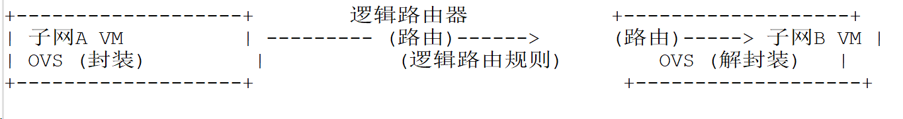
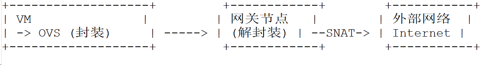

---
kind:
  - Troubleshooting
products:
  - Alauda Container Platform
  - Alauda DevOps
  - Alauda AI
  - Alauda Application Services
  - Alauda Service Mesh
  - Alauda Developer Portal
ProductsVersion:
  - 4.1.0,4.2.x
---
<!-- A type of document that involves encountering a fault, diagnosing it, performing root cause analysis, and providing solutions. -->

# 复制从 Overlay流量拓扑

同一主机的VM间无法通信 跨主机的VM间（同子网）通信失败 跨子网通信失败

## Cause
- OVS流表未正确配置本地转发规则
- ACLs阻止了VM间的流量
- 隧道封装使用的VXLAN/Geneve隧道ID不匹配
- 逻辑路由器未正确配置路由或NAT规则
- 网关节点未正确处理SNAT或物理网络出口

## Resolution
- 检查OVS流表（如`ovs-ofctl dump-flows br-int`）确认本地转发规则
- 验证ACL规则是否允许预期流量
- 检查隧道端点配置及隧道ID是否一致
- 验证逻辑路由器的路由表及NAT配置
- 检查网关节点的隧道封装状态及物理网络连通性

## [workaround]

## [Related Information]
**Screenshots**

* 

- Environment: OVN的Overlay网络环境，使用VXLAN/Geneve隧道，包含逻辑交换机、逻辑路由器、OVS及网关节点
- 逻辑交换机
- OVS
- VXLAN/Geneve隧道
- 逻辑路由器
- ACLs
- 网关节点
- Component: kube-Ovn
- Page ID: 274710387
- Original Title: 复制从 Overlay流量拓扑
