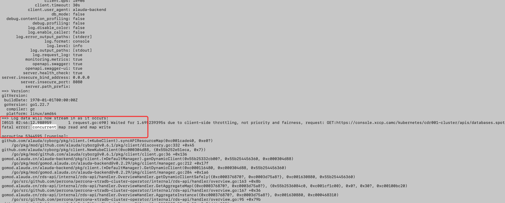

---kind:   - Troubleshootingproducts:    - Alauda Container Platform   - Alauda DevOps   - Alauda AI   - Alauda Application Services   - Alauda Service Mesh   - Alauda Developer PortalProductsVersion:   - 4.1.0,4.2.x---<!-- A type of document that involves encountering a fault, diag...it, performing root cause analysis, and providing solutions. --># rds服务重启 内存不足错误 内存使用率95%以上## Cause- 内存限制设置不足- 业务增长需求未调整配置## Resolution- 调整Pod资源限制增加内存配额- 优化服务内存使用减少缓存- 设置HPA(Horizontal Pod Autoscaler)策略- 配置内存使用率80%预警## [workaround]## [Related Information]**Screenshots**- Environment: v3.18.1- Kubernetes- Pod资源限制- HPA- OOM Killer- Component: Kubernetes- Page ID: 299139850- Original Title: 数据服务-rds-api重启-108517-zh