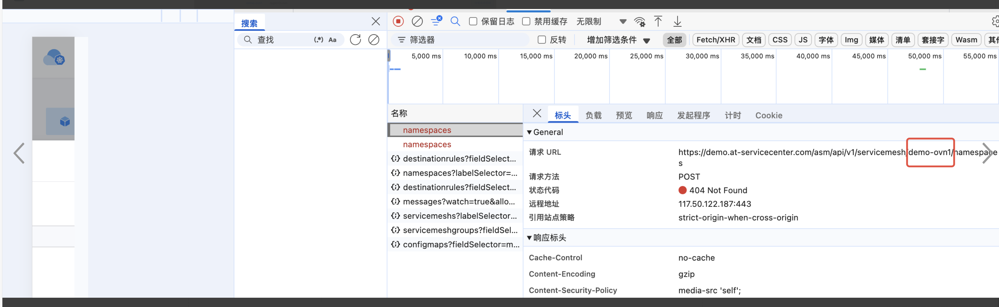
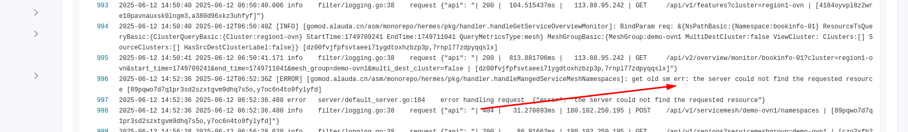
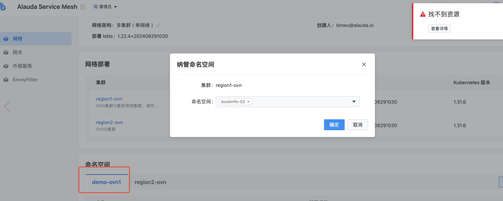
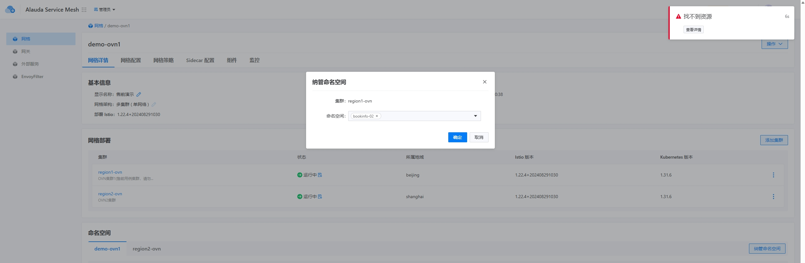

---kind:   - Troubleshootingproducts:    - Alauda Container Platform   - Alauda DevOps   - Alauda AI   - Alauda Application Services   - Alauda Service Mesh   - Alauda Developer PortalProductsVersion:   - 4.1.0,4.2.x---<!-- A type of document that involves encountering a fault, diag...it, performing root cause analysis, and providing solutions. --># demo.at 售前演示环境，微服务平台服务纳管命名空间纳管命名空间时系统未正确识别配置 日志显示权限验证失败## Cause- 命名空间标签配置不符合微服务平台纳管要求## Resolution- kubectl label ns <namespace> <required_label_key>=<value>- 重新执行纳管操作- 检查微服务平台 v3.18.0 与 Kubernetes API 版本兼容性## [workaround]## [Related Information]**Screenshots**- Environment: v3.18.0- labels- RBAC- Kubernetes API version- namespace configuration- Component: Kubernetes- Page ID: 302286049- Original Title: 微服务-demo.at 售前演示环境，微服务平台服务纳管命名空间-110572-zh