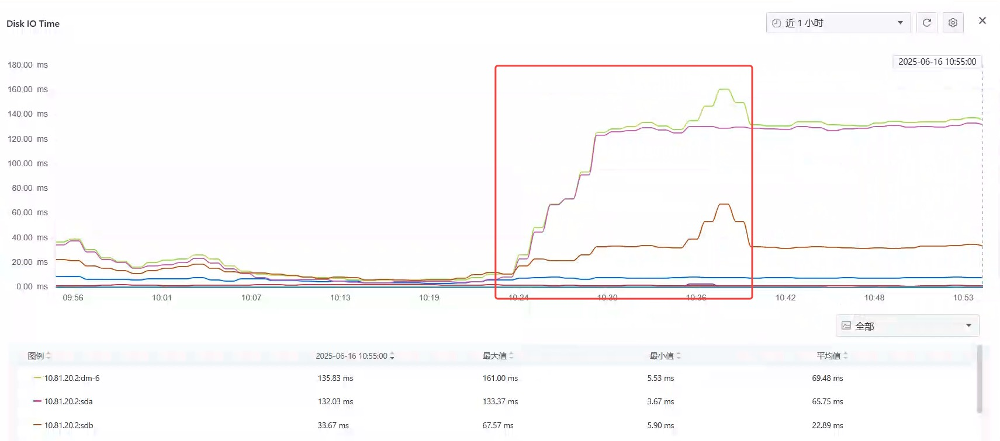
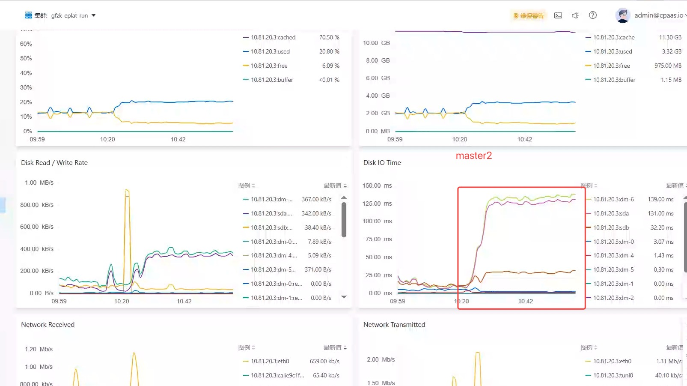
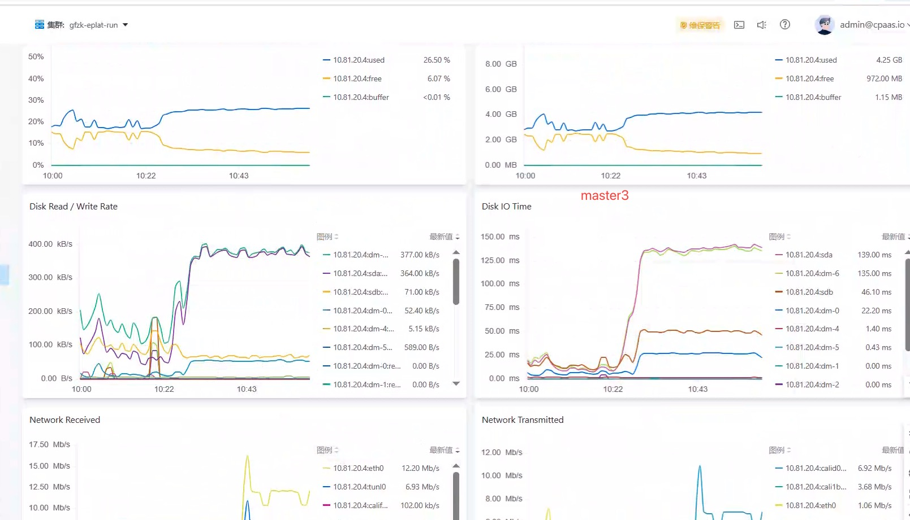
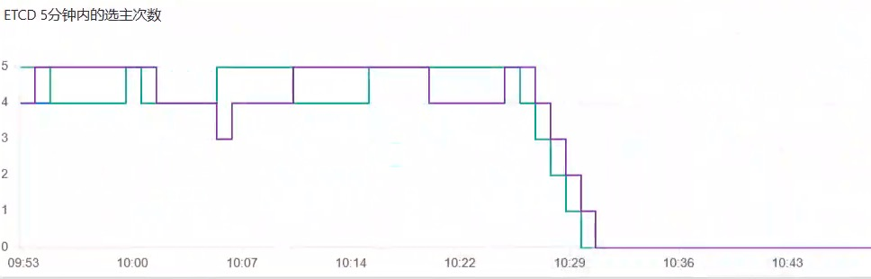
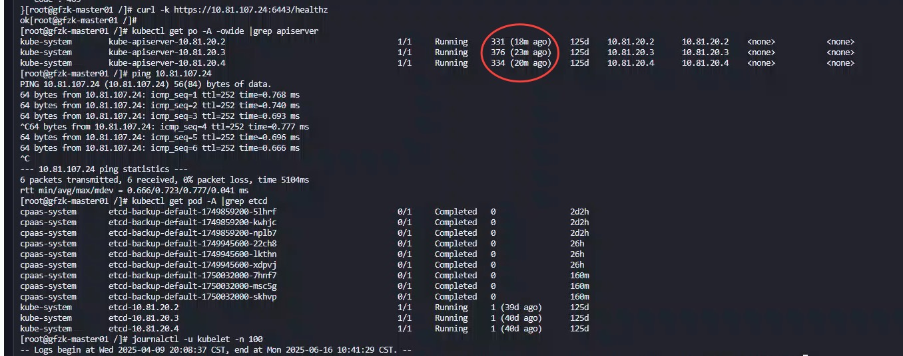
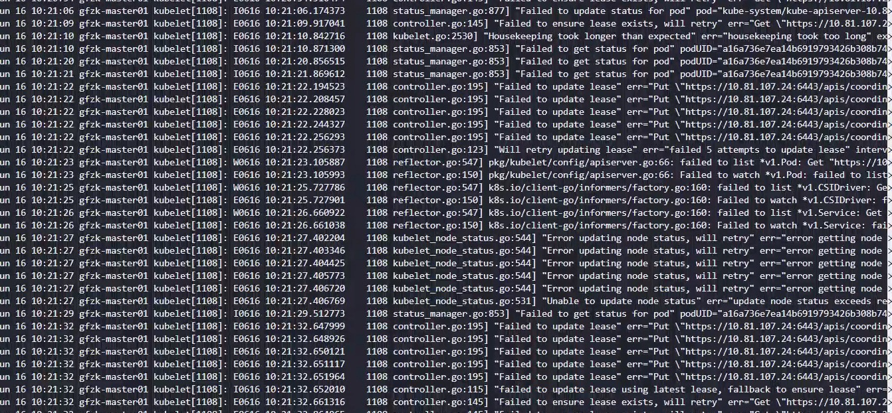
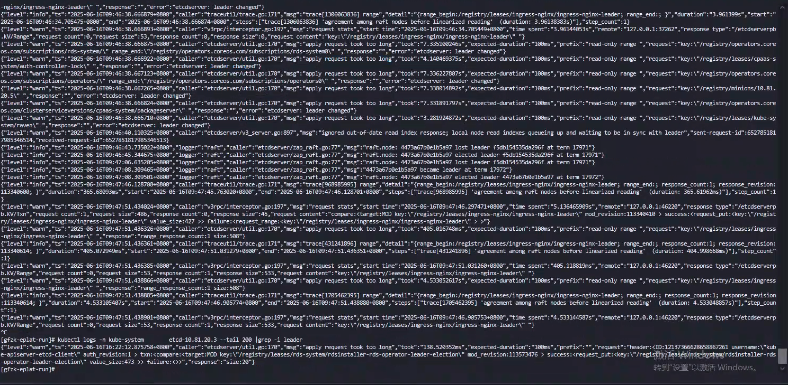

---kind:   - Troubleshootingproducts:    - Alauda Container Platform   - Alauda DevOps   - Alauda AI   - Alauda Application Services   - Alauda Service Mesh   - Alauda Developer PortalProductsVersion:   - 4.1.0,4.2.x---<!-- A type of document that involves encountering a fault, diag...it, performing root cause analysis, and providing solutions. --># controllercontroller-manager频繁重启 Pod处于CrashLoopBackOff状态 启动时出现OOM错误## Cause- 内存不足导致OOM## Resolution- 增加controller-manager Pod的内存限制- 调整controller-manager的启动参数优化内存使用- 监控controller-manager的运行状态## [workaround]## [Related Information]**Screenshots**- Environment: Kubernetes v3.18.1- controller-manager- resources.limits.memory- Component: Kubernetes- Page ID: 308820913- Original Title: 基础架构-controller-manager出现异常-110731-zh