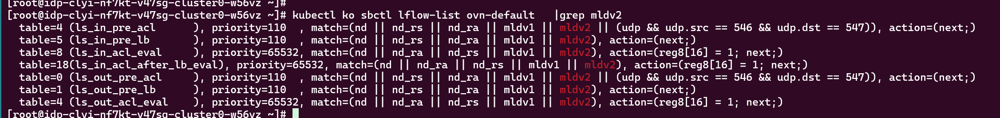

---kind:   - Troubleshootingproducts:    - Alauda Container Platform   - Alauda DevOps   - Alauda AI   - Alauda Application Services   - Alauda Service Mesh   - Alauda Developer PortalProductsVersion:   - 4.1.0,4.2.x---<!-- A type of document that involves encountering a fault, diag...it, performing root cause analysis, and providing solutions. --># 开启nodelocaldns和networkpolicy后域名解析失败。开启nodelocaldns和networkpolicy后域名解析失败## Cause- nodelocaldns返回业务pod的报文被丢弃，需在流表中放行源IP为169.254.20.10的报文- nodelocaldns请求coredns时使用节点IP，networkpolicy未放行节点IP段（如192.168.0.0/16）## Resolution- 修改NetworkPolicy，放行100.64.0.0/16、192.168.0.0/16、169.254.20.10/32的CIDR- 添加egress规则允许到169.254.20.10/32的流量## [workaround]## [Related Information]**Screenshots**- Environment: Kube-OVN CNI 1.14.0- 169.254.20.10- 53/UDP- nodelocaldns- coredns- NetworkPolicy- ipBlock- 流表规则- Component: Kubernetes- Page ID: 310085067- Original Title: 开启nodelocaldns和networkpolicy后域名解析失败。