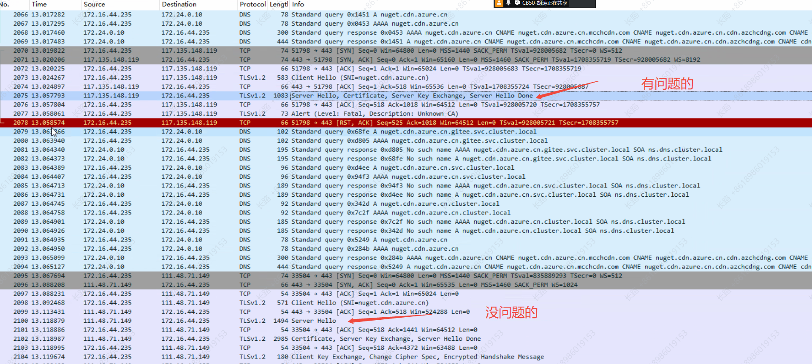
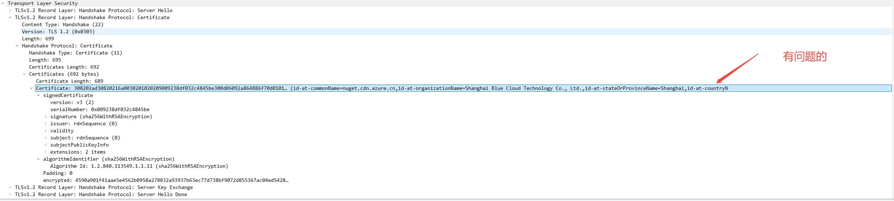
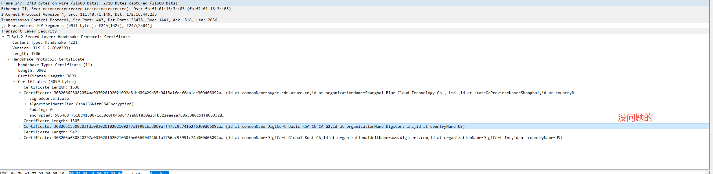

---kind:   - Troubleshootingproducts:    - Alauda Container Platform   - Alauda DevOps   - Alauda AI   - Alauda Application Services   - Alauda Service Mesh   - Alauda Developer PortalProductsVersion:   - 4.1.0,4.2.x---<!-- A type of document that involves encountering a fault, diag...it, performing root cause analysis, and providing solutions. --># 合肥晶合集群内pod 下载外网的文件时好时坏pod内curl外网文件时好时坏 解析到117.136.148.119时出现unknown CA错误 解析到111.48.71.149时认证正常## Cause- 服务器返回的证书链不完整- CDN可能返回错误的证书链配置## Resolution- 检查CDN配置是否返回完整证书链## [workaround]## [Related Information]**Screenshots**- Environment: acp 3.18.1- 域名解析- TLS证书链- CDN配置- Component: Kubernetes- Page ID: 316670691- Original Title: 合肥晶合集群内pod 下载外网的文件时好时坏