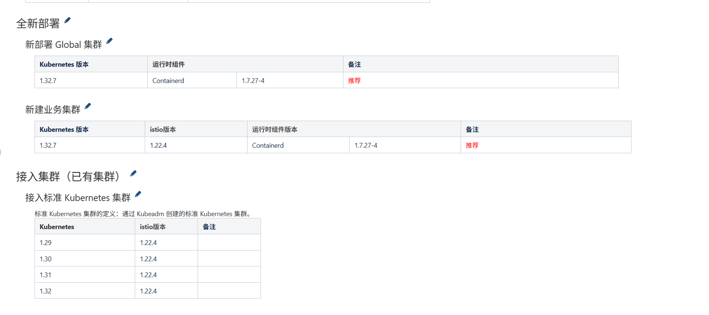

---kind:   - Troubleshootingproducts:    - Alauda Container Platform   - Alauda DevOps   - Alauda AI   - Alauda Application Services   - Alauda Service Mesh   - Alauda Developer PortalProductsVersion:   - 4.1.0,4.2.x---<!-- A type of document that involves encountering a fault, diag...it, performing root cause analysis, and providing solutions. --># 后续4.0发版计划咨询JIRA Jira：## Cause## Resolution## [workaround]## [Related Information]**Screenshots**- Environment: 4.0- acp版本- k8s版本- 集群升级- 新建集群- Component: Kubernetes- Page ID: 323682810- Original Title: 容器平台-后续4.0发版计划咨询-113665