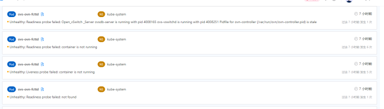
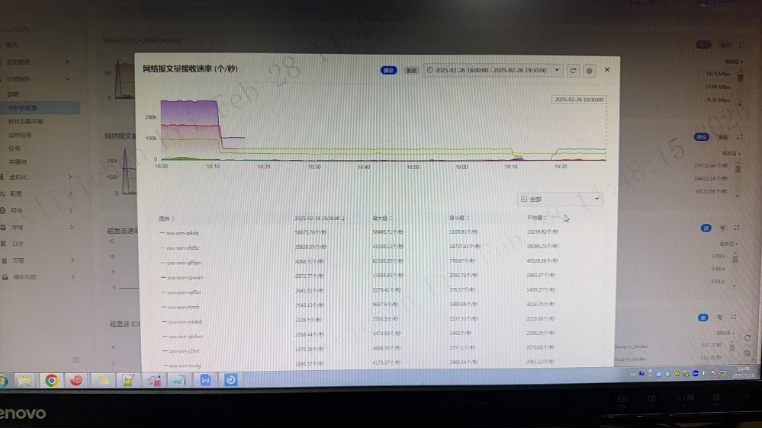
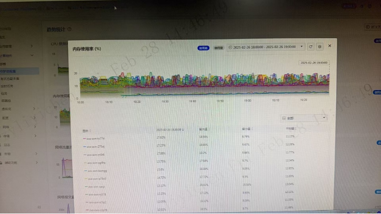
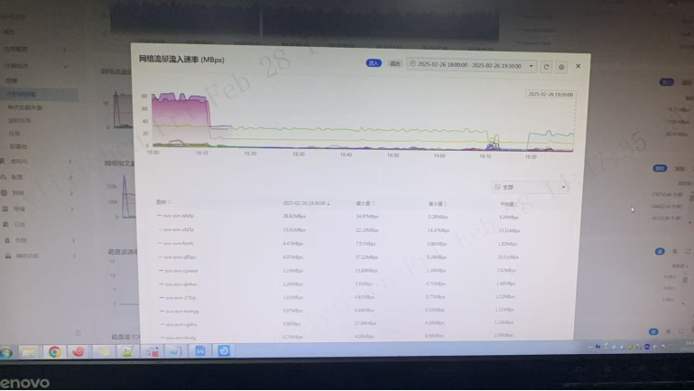
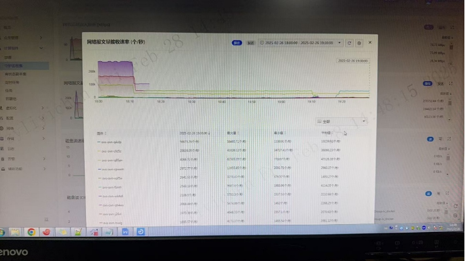
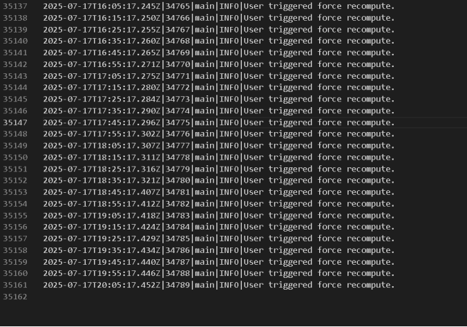
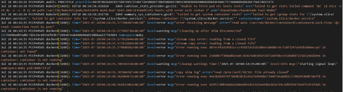

---
kind:
  - Troubleshooting
products:
  - Alauda Container Platform
  - Alauda DevOps
  - Alauda AI
  - Alauda Application Services
  - Alauda Service Mesh
  - Alauda Developer Portal
ProductsVersion:
  - 4.1.0,4.2.x
---
<!-- A type of document that involves encountering a fault, diagnosing it, performing root cause analysis, and providing solutions. -->

# Kube

Pod 事件报 'container is not running' 和 'probe failed' Docker 日志报错 'cleaning up after shim disconnected' 容器退出码为 255

## Cause
- Docker/Containerd 兼容性问题（如 Docker 20.10.7 存在 containerd-shim 进程管理缺陷）
- 安全软件可能误杀容器进程

## Resolution
- 升级集群至新版本并使用更新版本的 Docker/Containerd（如从 20.10.7 升级到官方推荐版本）
- 临时关闭安全组件测试（需符合安全规范并备份配置）

## [workaround]

## [Related Information]
**Screenshots**

* 
* 
- Environment: 3.8.3
- /var/log/openvswitch/ovs-vswitchd.log
- OVN 日志
- containerd-shim
- Docker 日志 /var/log/docker.log
- Kubelet 日志
- containerd.sock
- Component: kube-Ovn
- Page ID: 324174035
- Original Title: 容器平台-网络-Kube-OVN-ovs-ovn健康检查失败重启-113266
