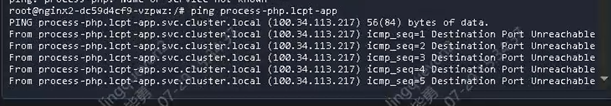
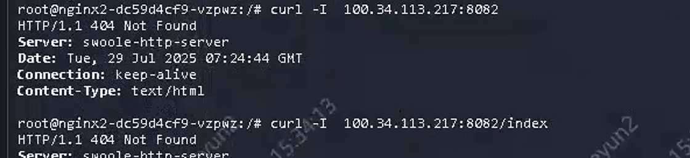

---kind:   - Troubleshootingproducts:    - Alauda Container Platform   - Alauda DevOps   - Alauda AI   - Alauda Application Services   - Alauda Service Mesh   - Alauda Developer PortalProductsVersion:   - 4.1.0,4.2.x---<!-- A type of document that involves encountering a fault, diag...it, performing root cause analysis, and providing solutions. --># 测试环境同项目不同命名空间的容器访问受限lcpt-middleware空间下process-nginx无法访问lcpt-app空间的应用 ping命令显示解析到k8s内部路由但无响应 通过IP+端口可正常联通## Cause- Kubernetes内部路由使用虚拟IP，不支持ICMP协议- 跨命名空间服务发现可能依赖DNS解析而非直接IP访问## Resolution## [workaround]- 使用TCP/UDP协议通过具体IP+端口进行访问- 检查服务发现配置确保跨命名空间解析正常## [Related Information]**Screenshots**- Environment: 3.18.1- k8s内部路由- 虚拟IP- 服务名解析- 跨命名空间通信- Component: Kubernetes- Page ID: 324174413- Original Title: 容器平台-网络-其他CNI组件-测试环境同项目不同命名空间的容器访问受限-114004