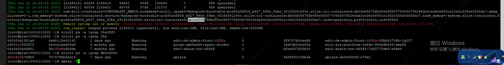
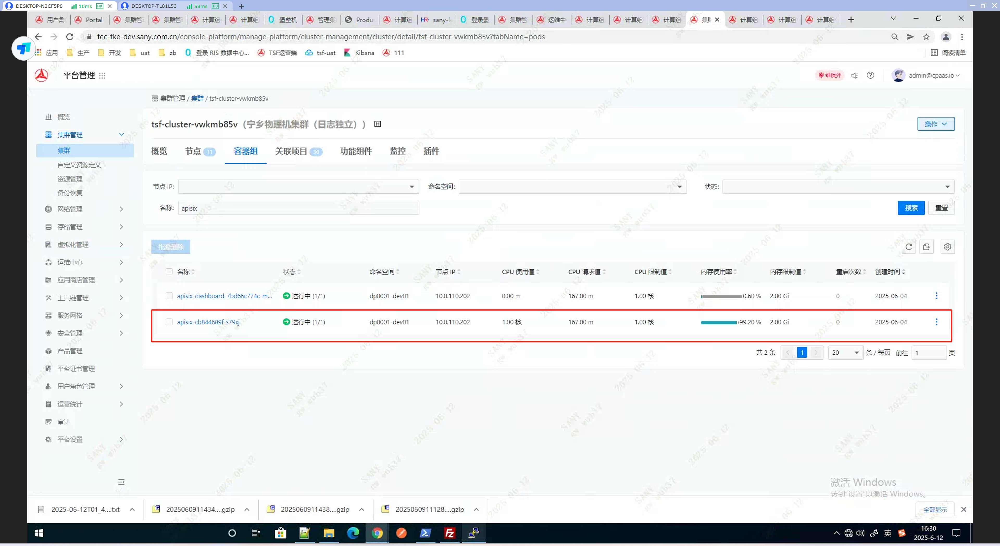

---kind:   - Troubleshootingproducts:    - Alauda Container Platform   - Alauda DevOps   - Alauda AI   - Alauda Application Services   - Alauda Service Mesh   - Alauda Developer PortalProductsVersion:   - 4.1.0,4.2.x---<!-- A type of document that involves encountering a fault, diag...it, performing root cause analysis, and providing solutions. --># dev环境 主机发生大量pod oom 请分析原因，并提供优化方案。JIRA Jira：## Cause- dev环境 主机发生大量pod oom 请分析原因，并提供优化方案。## Resolution- 登录202节点查看dmesg日志发现存在openresty的进程触发了cgroup oom 频繁重启，对应服务为apisix- k8s 判断 Pod 是否需要重启，其核心依据是容器内主进程的状态，其中被kill掉的进程为apisix服务的子进程，而非主进程所以pod并未重启。- ## 解决方案## [workaround]## [Related Information]**Screenshots**- 2589- 2587- /download/attachments/327811964/- pod- 12- //tec-tke-dev.sany.com.cn/console-platform/manage-platform/maintenance-center/alarm- /list- /tmp/dmesg.log- /rong-qi-ping-tai-devhuan-jing-zhu-ji-fa-sheng-da-liang-pod-oom-qing-fen-xi-yuan/mceclip4_1749719710048_f768o.png- /rong-qi-ping-tai-devhuan-jing-zhu-ji-fa-sheng-da-liang-pod-oom-qing-fen-xi-yuan/mceclip5_1749719719716_a0lka.png- Component: Kubernetes- Page ID: 327811964- Original Title: 容器平台-dev环境 主机发生大量pod oom 请分析原因，并提供优化方案。-110533