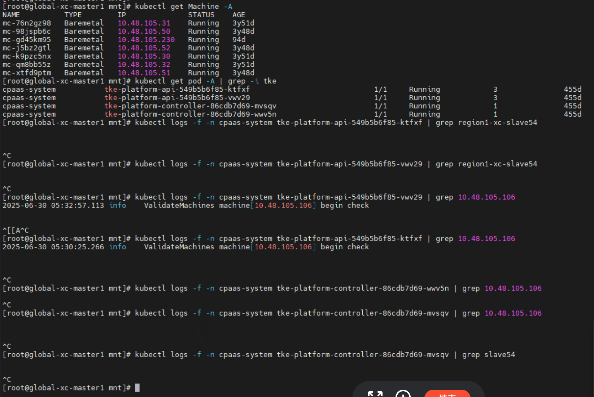
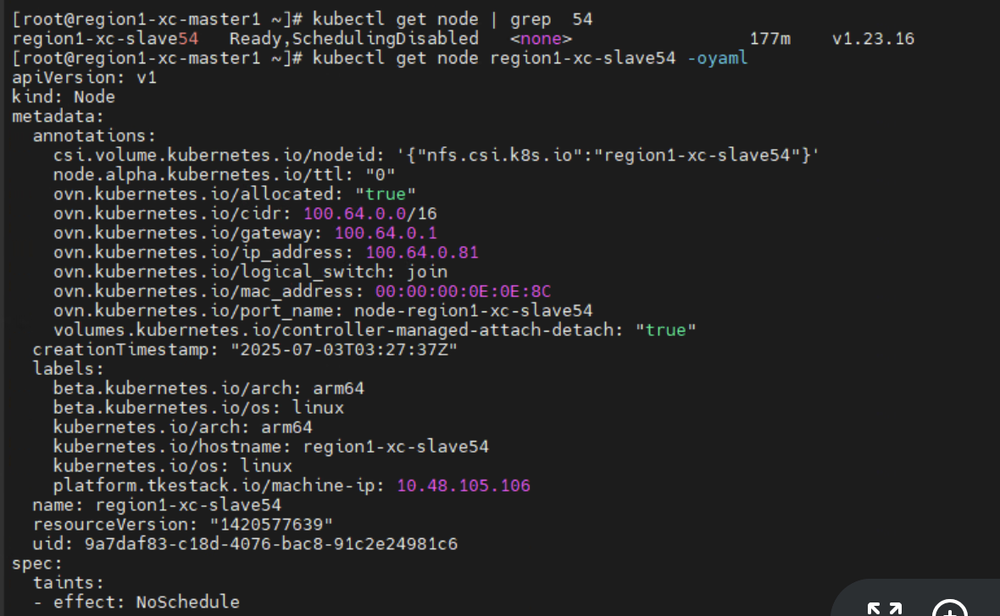
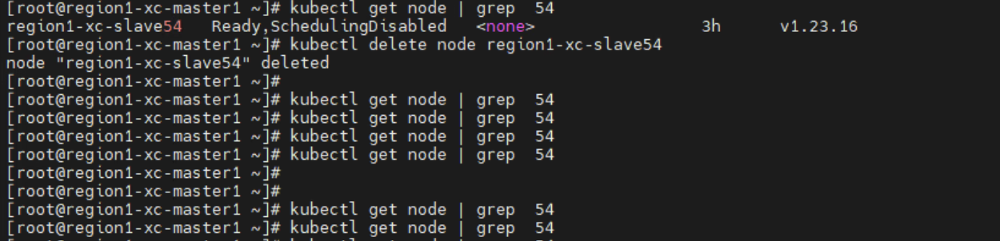

---kind:   - Troubleshootingproducts:    - Alauda Container Platform   - Alauda DevOps   - Alauda AI   - Alauda Application Services   - Alauda Service Mesh   - Alauda Developer PortalProductsVersion:   - 4.1.0,4.2.x---<!-- A type of document that involves encountering a fault, diag...it, performing root cause analysis, and providing solutions. --># 删除节点后过一会集群里还会出现这个节点删除节点后集群中重新出现该节点 节点虚拟机已更换IP但仍显示Running状态 无法ping通被删除节点## Cause- 节点IP变更导致状态不一致- 可能存在自动恢复/重新注册机制## Resolution- 手动执行kubectl delete node操作- 检查节点池自动伸缩配置## [workaround]- 彻底清理节点关联资源后再观察## [Related Information]**Screenshots**- Environment: TKE 3.12.1- machine资源- tke组件日志- kubectl delete node命令- Component: Kubernetes- Page ID: 330465842- Original Title: 基础架构-产品生命周期管理-删除节点后过一会集群里还会出现这个节点-112186