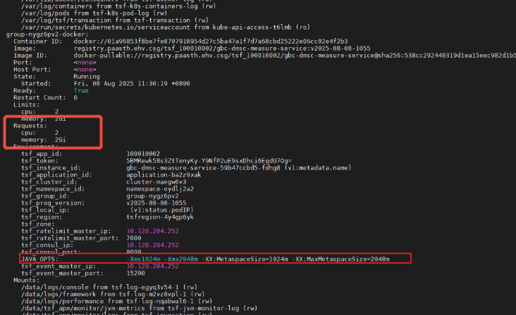

---kind:   - Troubleshootingproducts:    - Alauda Container Platform   - Alauda DevOps   - Alauda AI   - Alauda Application Services   - Alauda Service Mesh   - Alauda Developer PortalProductsVersion:   - 4.1.0,4.2.x---<!-- A type of document that involves encountering a fault, diag...it, performing root cause analysis, and providing solutions. --># node描述的cpu和request值过大且相等，不受deployment资源限制node描述的cpu和request值过大且相等 资源请求值过高导致节点资源浪费 deployment资源限制未生效## Cause- 应用关联TSF启动的容器请求值设置过高(如1c2g/2c2g)- 可能存在其他资源管理机制(如TSF)覆盖deployment配置- 集群/项目/命名空间超售比设置不当## Resolution- 检查pod yaml中的resources资源配置- 确认应用是否受TSF等其他资源控制器管理- 检查集群/项目/命名空间超售比配置- 调整应用容器的requests值到合理范围- 确保deployment中正确配置limits/requests参数## [workaround]## [Related Information]**Screenshots**- Environment: 3.10.2- deployment- tsf- pod yaml- resources.requests- resources.limits- oversubscription ratio- Component: Kubernetes- Page ID: 330465870- Original Title: 容器平台-其他-node描述的cpu和request值过大且相等，不受deployment资源限制-114754