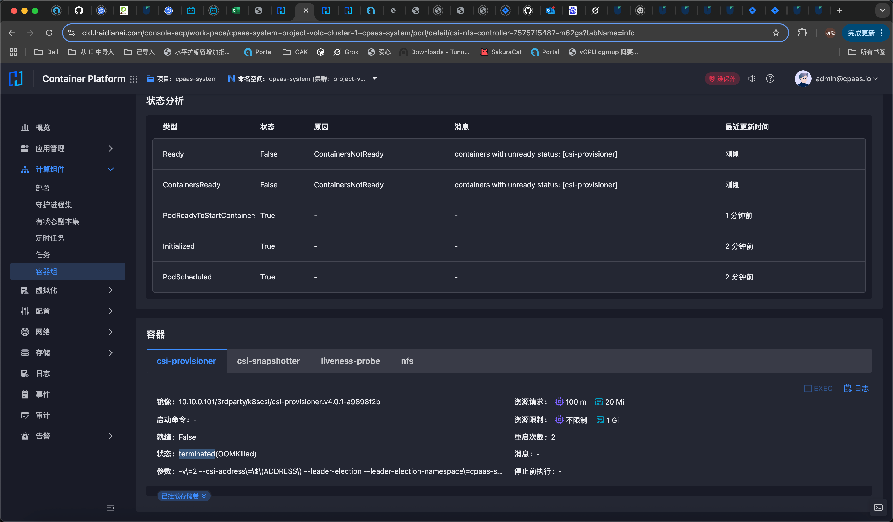
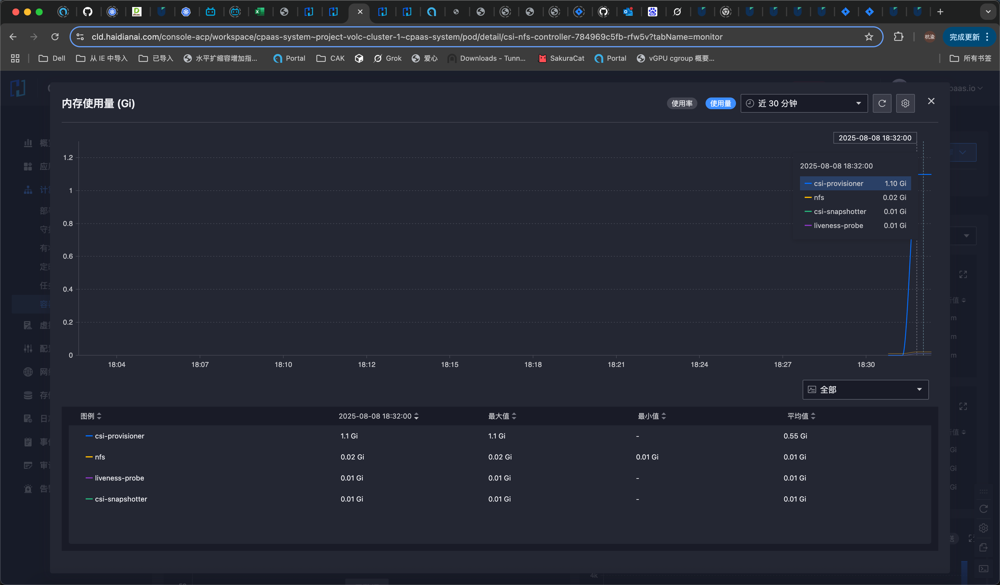

---kind:   - Troubleshootingproducts:    - Alauda Container Platform   - Alauda DevOps   - Alauda AI   - Alauda Application Services   - Alauda Service Mesh   - Alauda Developer PortalProductsVersion:   - 4.1.0,4.2.x---<!-- A type of document that involves encountering a fault, diag...it, performing root cause analysis, and providing solutions. --># 无法创建nas存储pvc无法创建NAS PVC PVC报错ExternalProvisioning等待卷创建 csi-provisioner组件出现OOM错误## Cause- csi-provisioner组件内存不足(OOM)导致无法处理PVC请求## Resolution- 将csi-provisioner内存限制从1G提升至2G## [workaround]## [Related Information]**Screenshots**- Environment: 3.18.1- nfs.csi.k8s.io- csi-nfs-controller- csi-provisioner- SC- PVC- Component: Kubernetes- Page ID: 330466257- Original Title: 容器平台-存储-nfs存储-无法创建nas存储pvc-114778