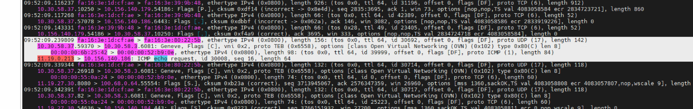
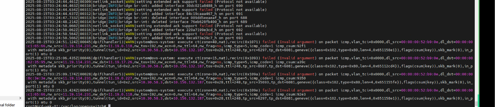
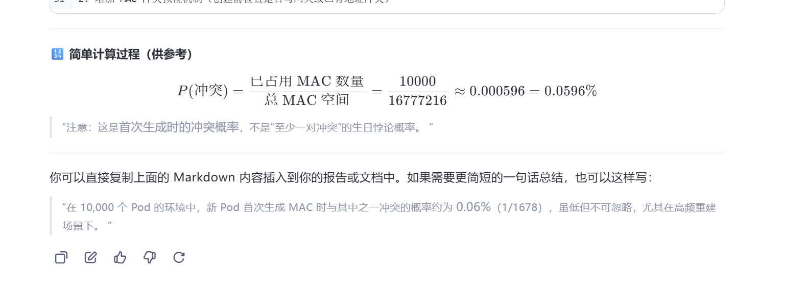

---kind:   - Troubleshootingproducts:    - Alauda Container Platform   - Alauda DevOps   - Alauda AI   - Alauda Application Services   - Alauda Service Mesh   - Alauda Developer PortalProductsVersion:   - 4.1.0,4.2.x---<!-- A type of document that involves encountering a fault, diag...it, performing root cause analysis, and providing solutions. --># 中化集群网关mac冲突导致子网内流量异常大部分Pod无法访问Service和节点网络 访问Pod CIDR正常 ovs-vswitchd.log中出现大量ICMP重定向报文## Cause- topolvm-vg-prepare Pod的MAC地址与子网网关MAC地址冲突## Resolution- 实施MAC地址扩容方案（新版本已支持）- 在Pod创建时增加MAC地址冲突检查机制## [workaround]- 重置集群数据库临时恢复环境## [Related Information]**Screenshots**- Environment: acp 3.14.1- 6443端口- kube-ovn-controller- topolvm-vg-prepare- ovs-vswitchd.log- chassis表- Component: Kubernetes- Page ID: 332038329- Original Title: 中化集群网关mac冲突导致子网内流量异常