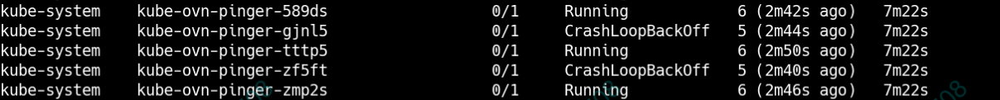
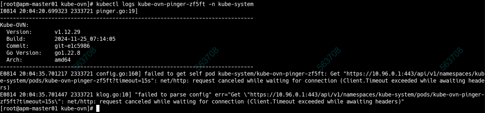

---
kind:
  - Troubleshooting
products:
  - Alauda Container Platform
  - Alauda DevOps
  - Alauda AI
  - Alauda Application Services
  - Alauda Service Mesh
  - Alauda Developer Portal
ProductsVersion:
  - 4.1.0,4.2.x
---
<!-- A type of document that involves encountering a fault, diagnosing it, performing root cause analysis, and providing solutions. -->

# Kube

ovn组件pinger异常 连接apiserver失败

## Cause
- 内核版本过高（49）
- 可能受checksum影响

## Resolution
- 将操作系统内核版本从49降级到44

## [workaround]
- 执行`ethtool -K eth0 tx off`并重启pinger（无效）

## [Related Information]
**Screenshots**

- Environment: 麒麟v10 sp3，内核版本49
- pinger
- apiserver
- eth0
- ethtool
- Kube-OVN
- Component: kube-Ovn
- Page ID: 333316443
- Original Title: 容器平台-网络-Kube-OVN-新建集群不成功-115240
