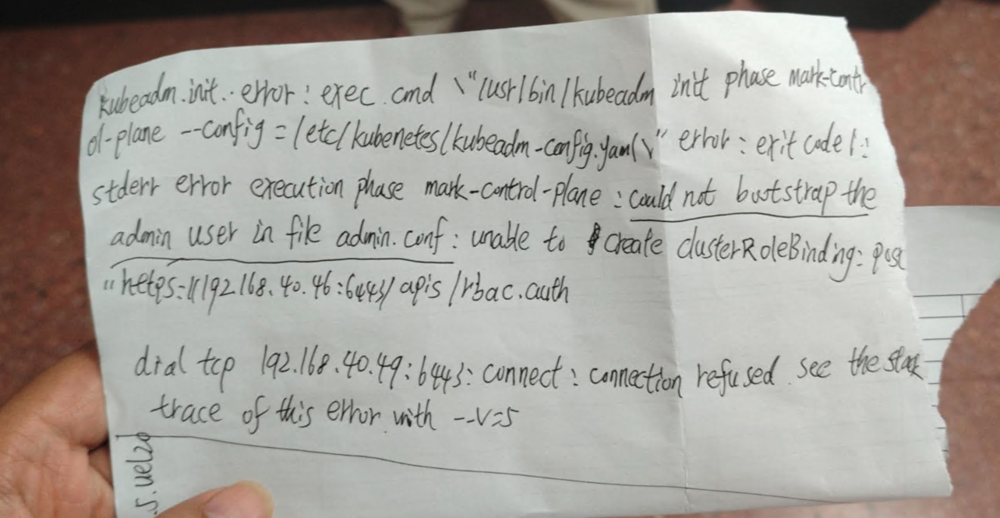

---kind:   - Troubleshootingproducts:    - Alauda Container Platform   - Alauda DevOps   - Alauda AI   - Alauda Application Services   - Alauda Service Mesh   - Alauda Developer PortalProductsVersion:   - 4.1.0,4.2.x---<!-- A type of document that involves encountering a fault, diag...it, performing root cause analysis, and providing solutions. --># uos系统部署集群卡在k8s阶段 kubeadm报错tls: first record does not look like a TLS handshake kubelet报错open /var/lib/kubelet/config.yaml: no such file or directory## Cause- UOS系统缺少必要内核参数导致sysctl配置不生效- 内核参数文件/etc/sysctl.d/99-tke.conf未正确加载## Resolution- 手动执行sysctl -p /etc/sysctl.d/99-tke.conf -e加载内核参数- 检查/etc/sysctl.d/99-tke.conf文件完整性## [workaround]## [Related Information]**Screenshots**- Environment: UOS v20 军用版, Kubernetes 4.0.3- kubeadm- kubelet- containerd- /var/lib/kubelet/config.yaml- /etc/sysctl.d/99-tke.conf- 6443端口- ClusterRoleBinding- Component: Kubernetes- Page ID: 333316791- Original Title: 基础架构-uos系统-部署集群卡住-115123