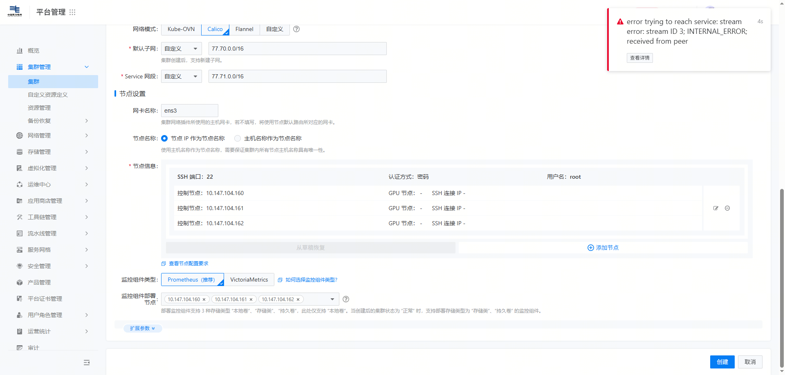

---kind:   - Troubleshootingproducts:    - Alauda Container Platform   - Alauda DevOps   - Alauda AI   - Alauda Application Services   - Alauda Service Mesh   - Alauda Developer PortalProductsVersion:   - 4.1.0,4.2.x---<!-- A type of document that involves encountering a fault, diag...it, performing root cause analysis, and providing solutions. --># TKE创建新集群失败页面报错 error trying to reach service: stream error: stream ID 13; INTERNAL_ERROR; received from peer 添加节点失败 tke-platform-api 日志显示证书相关报错## Cause- api-server 证书过期或无效## Resolution- 更新 api-server 证书- 重启 api-server pod 同步证书信息## [workaround]## [Related Information]**Screenshots**- Environment: 3.10.2- api-server- tke-platform-api- k8s 基础组件- Component: Kubernetes- Page ID: 339443720- Original Title: 基础架构-产品生命周期管理-部署-TKE创建新集群失败-114502