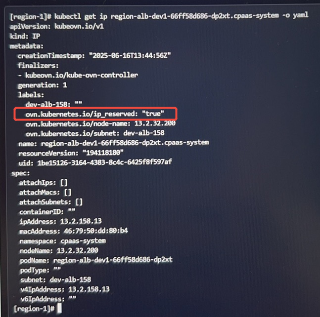

---
kind:
  - Troubleshooting
products:
  - Alauda Container Platform
  - Alauda DevOps
  - Alauda AI
  - Alauda Application Services
  - Alauda Service Mesh
  - Alauda Developer Portal
ProductsVersion:
  - 4.1.0,4.2.x
---
<!-- A type of document that involves encountering a fault, diagnosing it, performing root cause analysis, and providing solutions. -->

# 偶现 IP 资源不释放

Subnet shows 2 IPs in use, but only one is actually used Abnormal IP resource with reserved label exists

## Cause
- Handling IP resource add event queries OVN LSP and incorrectly marks IP as reserved when LSP is not found

## Resolution
- Apply the fix from https://github.com/kubeovn/kube-ovn/pull/5698

## [workaround]

## [Related Information]
**Screenshots**

- Environment: Kubernetes with kube-ovn v1.13/v1.14
- OVN LSP
- reserved label
- kube-ovn
- Component: kube-ovn
- Page ID: 341196336
- Original Title: 偶现 IP 资源不释放
