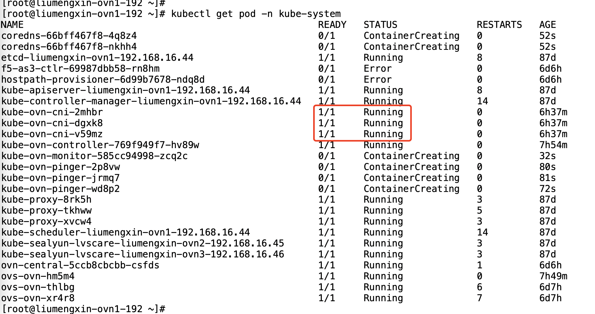

---
kind:
  - Troubleshooting
products:
  - Alauda Container Platform
  - Alauda DevOps
  - Alauda AI
  - Alauda Application Services
  - Alauda Service Mesh
  - Alauda Developer Portal
ProductsVersion:
  - 4.1.0,4.2.x
---
<!-- A type of document that involves encountering a fault, diagnosing it, performing root cause analysis, and providing solutions. -->

# kube

kube-ovn-cni pod持续crash重启 日志提示ovn0网卡不通

## Cause
- Logical Switch(ls)与Logical Router(lr)连接端口的MAC地址不一致

## Resolution
- 执行命令修改ls/lr端口MAC地址一致: kubectl ko nbctl lsp-set-addresses join-ovn-cluster 00:00:00:8A:9A:75

## [workaround]

## [Related Information]
**Screenshots**

- Environment: kube-ovn
- kube-ovn-cni
- ovn0
- Logical Switch
- Logical Router
- kubectl ko nbctl show
- join-ovn-cluster端口
- subnet配置
- Component: kube-ovn
- Page ID: 91240311
- Original Title: kube-ovn cni一直处于crash状态，提示ovn0网卡不通
