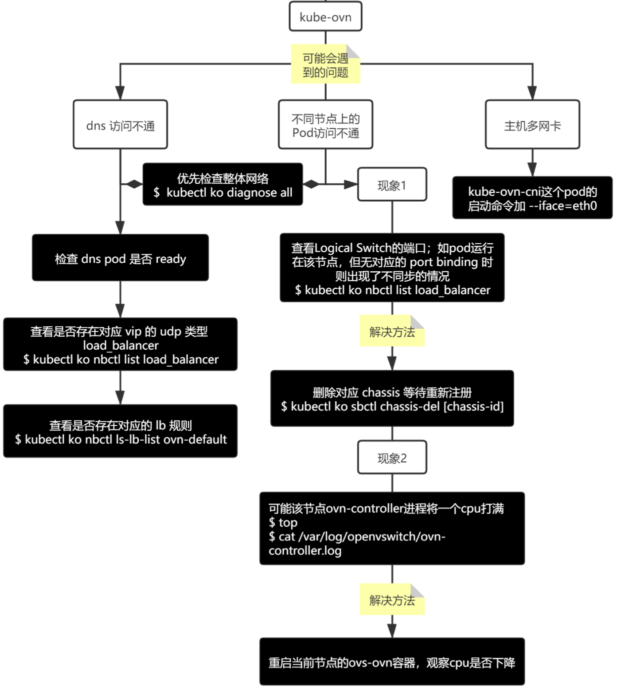

---
kind:
  - Troubleshooting
products:
  - Alauda Container Platform
  - Alauda DevOps
  - Alauda AI
  - Alauda Application Services
  - Alauda Service Mesh
  - Alauda Developer Portal
ProductsVersion:
  - 4.1.0,4.2.x
---
<!-- A type of document that involves encountering a fault, diagnosing it, performing root cause analysis, and providing solutions. -->

# Kube

dial unix /run/openvswitch/kube-ovn-daemon.sock: connect: no such file or directory request ip return 500 no available ip for pod ovn-central pod 均处于 pending 状态

## Cause
- kube-ovn-cni/ovs-ovn daemonset pod不存在
- 交换机trunk配置错误
- kube-scheduler存在权限问题
- 底层网络未放行UDP 6081端口
- provider-network/subnet/vlans对应关系错误

## Resolution
- 重启kube-controller-manager
- 检查交换机trunk配置并设置正确
- 检查kube-scheduler日志并重启docker
- 删除networkpolicy进行测试
- 执行ethtool -K ETH tx off关闭网卡校验

## [workaround]
- 网络管理员设置交换机trunk端口
- 关闭ovs checksum功能：ovs-vsctl set open . external-ids:ovn-encap-csum=false
- 添加iptables条目去掉无效标签

## [Related Information]
**Screenshots**

- Environment: 3.6
- /run/openvswitch/kube-ovn-daemon.sock
- UDP 6081
- kube-ovn-cni
- ovn-central
- provider-network
- subnet
- vlans
- Component: kube-ovn
- Page ID: 98881205
- Original Title: Kube-ovn 网络功能故障排查
