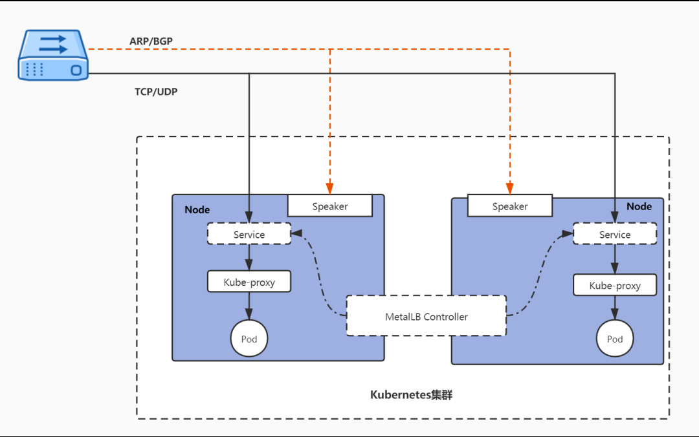
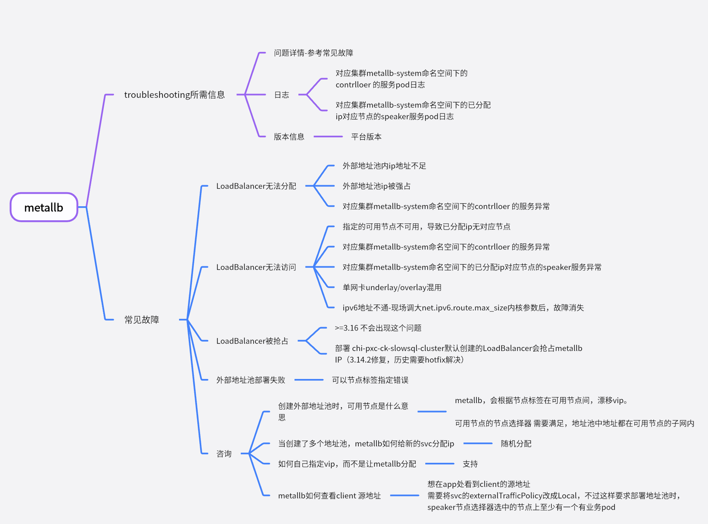

---
kind:
  - Troubleshooting
products:
  - Alauda Container Platform
  - Alauda DevOps
  - Alauda AI
  - Alauda Application Services
  - Alauda Service Mesh
  - Alauda Developer Portal
ProductsVersion:
  - 4.1.0,4.2.x
---
<!-- A type of document that involves encountering a fault, diagnosing it, performing root cause analysis, and providing solutions. -->

# 外部地址池（metallb）

LoadBalancer无法分配 LoadBalancer无法访问 LoadBalancer被抢占

## Cause
- 外部地址池IP不足或被强占
- 节点标签错误或节点异常
- metallb-system命名空间下的controller或speaker服务异常
- 单网卡underlay/overlay混用
- IPv6路由表大小限制（net.ipv6.route.max_size）
- 历史版本问题（如chi-pxc-ck-slowsql-cluster抢占IP）

## Resolution
- 检查地址池IP数量及占用情况
- 验证节点标签及网络连通性
- 重启metallb-controller（kubectl delete po -n metallb-system <controller-pod>）
- 调整net.ipv6.route.max_size内核参数
- 设置IPAddressPool的autoAssign为false并手动指定VIP（metallb.universe.tf/loadBalancerIPs）
- 更新平台版本或应用hotfix修复历史问题

## [workaround]
- 手动指定VIP（添加annotation metallb.universe.tf/loadBalancerIPs）
- 设置externalTrafficPolicy为Local以保留客户端源IP

## [Related Information]
**Screenshots**

- Environment: Kubernetes集群部署MetalLB（metallb-system命名空间），涉及Controller（Deployment）和Speaker（DaemonSet）组件，支持Layer2/BGP模式
- IPAddressPool
- L2Advertisement
- BGPPeer
- BGPAdvertisement
- metallb.universe.tf/loadBalancerIPs
- metallb.universe.tf/address-pool
- externalTrafficPolicy
- Component: metallb
- Page ID: 211780337
- Original Title: 外部地址池（metallb）
