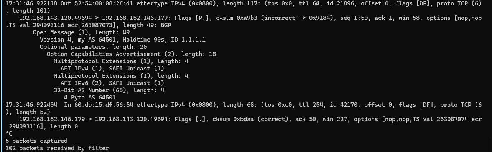
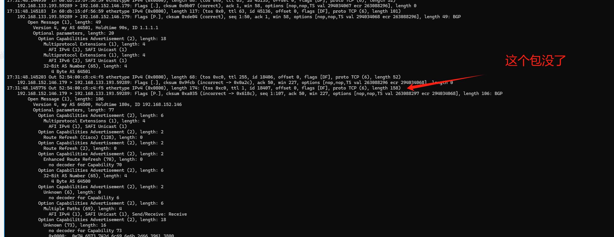
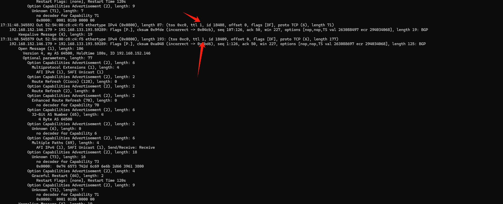

---
kind:
  - Troubleshooting
products:
  - Alauda Container Platform
  - Alauda DevOps
  - Alauda AI
  - Alauda Application Services
  - Alauda Service Mesh
  - Alauda Developer Portal
ProductsVersion:
  - 4.1.0,4.2.x
---
<!-- A type of document that involves encountering a fault, diagnosing it, performing root cause analysis, and providing solutions. -->

# metallb bgp 在配置EBGP 的时候发现路由同步失败

路由同步失败 BGP OPEN Message未到达metallb speaker端

## Cause
- BGP服务端返回的OPEN报文TTL=1被中间设备丢弃
- EBGP默认TTL=1

## Resolution
- 配置ebgp-multihop参数增加TTL值

## [workaround]

## [Related Information]
**Screenshots**

- Environment: Kubernetes 版本：3.18.0
- BGP peer
- neighbor 192.168.143.120 remote-as 64501
- neighbor 192.168.143.120 ebgp-multihop 5
- Component: metallb
- Page ID: 219090328
- Original Title: metallb bgp 在配置EBGP 的时候发现路由同步失败
