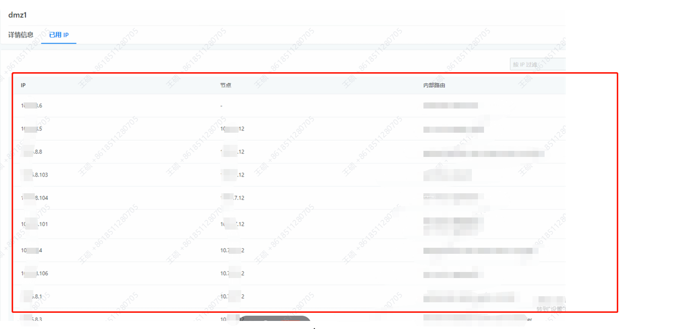

---
kind:
  - Troubleshooting
products:
  - Alauda Container Platform
  - Alauda DevOps
  - Alauda AI
  - Alauda Application Services
  - Alauda Service Mesh
  - Alauda Developer Portal
ProductsVersion:
  - 4.1.0,4.2.x
---
<!-- A type of document that involves encountering a fault, diagnosing it, performing root cause analysis, and providing solutions. -->

# 外部地址池

外部地址池界面不显示已用IP 界面报404错误 日志提示找不到名为dmz1的l2Advertisement资源

## Cause
- 平台侧Metallb默认使用ARP模式并创建l2Advertisement配置
- 业务侧自建Metallb为Layer2模式未配置l2Advertisement资源

## Resolution
- 手动创建缺失的l2Advertisement资源
- 从平台侧Metallb集群获取YAML模板，修改名称并去除uid后应用

## [workaround]

## [Related Information]
**Screenshots**

- Environment: 3.14.X
- l2Advertisement
- Metallb
- global-alb2-nginx容器
- dmz1
- Component: metallb
- Page ID: 227246660
- Original Title: 外部地址池-不显示已用IP（业务侧自建metallb）
