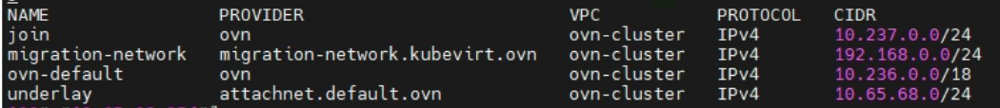
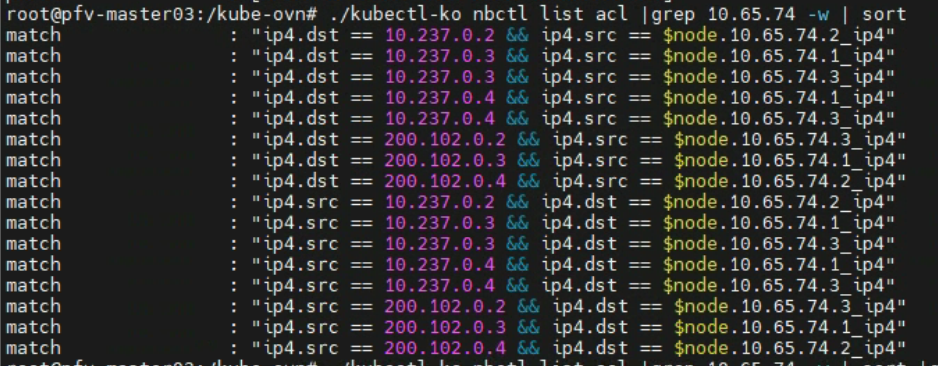
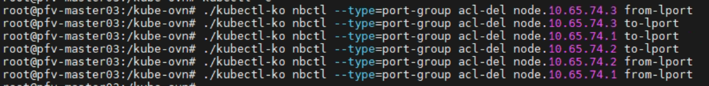
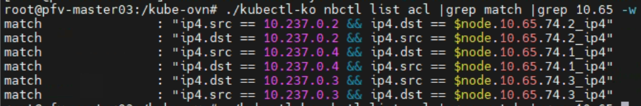

---
kind:
  - Troubleshooting
products:
  - Alauda Container Platform
  - Alauda DevOps
  - Alauda AI
  - Alauda Application Services
  - Alauda Service Mesh
  - Alauda Developer Portal
ProductsVersion:
  - 4.1.0,4.2.x
---
<!-- A type of document that involves encountering a fault, diagnosing it, performing root cause analysis, and providing solutions. -->

# 开启集群网络策略后节点无法与 Pod 通信

开启集群网络策略后节点间无法互ping对方节点上的Pod IP

## Cause
- ACL规则中残留旧join网段(200.102.0.0/24)配置

## Resolution
- 删除所有ACL规则
- 重启kube-ovn-controller使新ACL自动生成

## [workaround]

## [Related Information]
**Screenshots**

- Environment: Kubernetes, CNI: Kube-OVN v1.9, ACP 3.10.1
- ACL
- kube-ovn-controller
- join网段
- 子网配置
- Component: 集群网络策略
- Page ID: 136522847
- Original Title: 开启集群网络策略后节点无法与 Pod 通信
