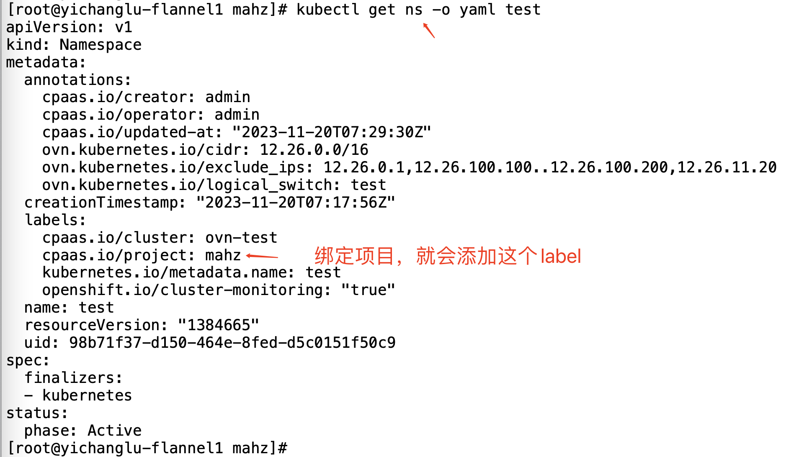
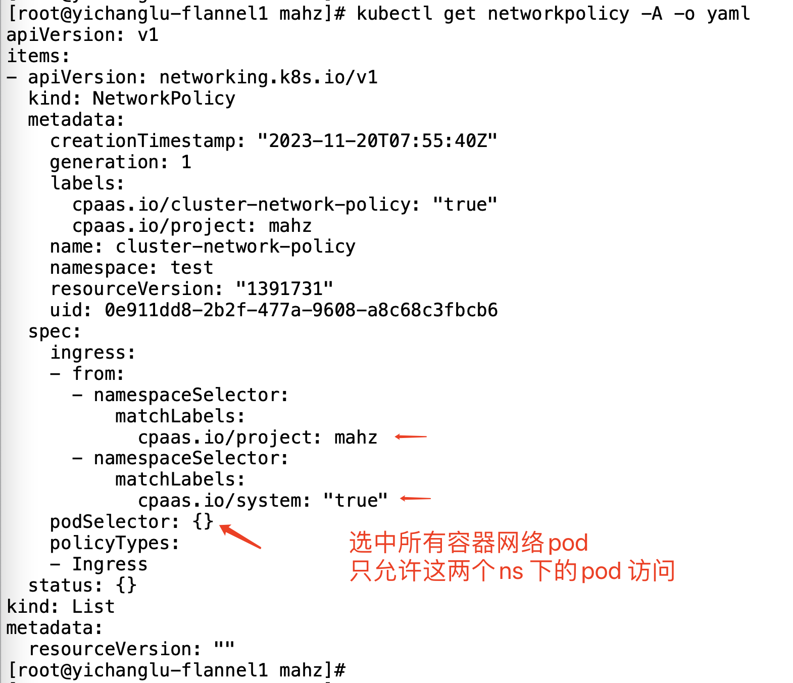
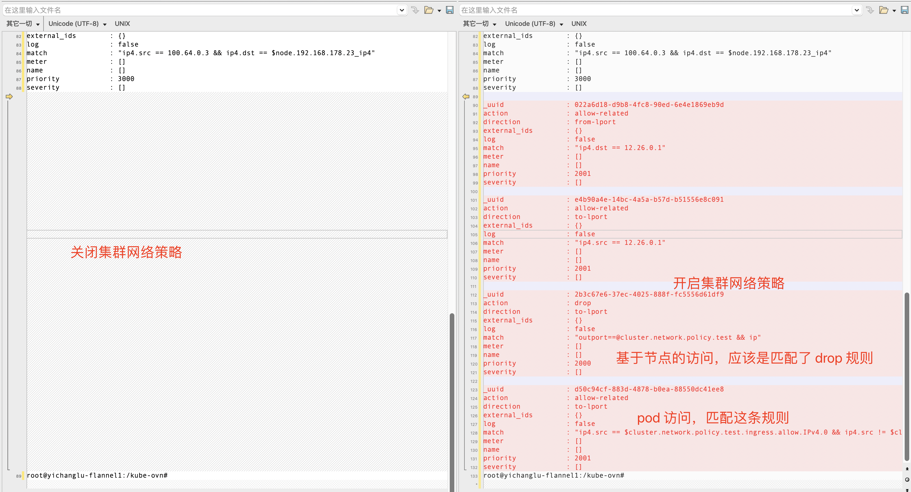

---
kind:
  - Troubleshooting
products:
  - Alauda Container Platform
  - Alauda DevOps
  - Alauda AI
  - Alauda Application Services
  - Alauda Service Mesh
  - Alauda Developer Portal
ProductsVersion:
  - 4.1.0,4.2.x
---
<!-- A type of document that involves encountering a fault, diagnosing it, performing root cause analysis, and providing solutions. -->

# 集群网络策略，限制node 跨节点访问pod

开启集群网络策略后，跨节点访问pod不通，匹配到drop规则

## Cause
- 集群网络策略生成的ACL规则默认阻止了跨节点访问pod的流量

## Resolution

## [workaround]

## [Related Information]
**Screenshots**

- Environment: CNI: kube-ovn v1.9.29 | ACP 3.12.2
- kube-ovn ACL规则
- 集群网络策略配置
- 子网绑定配置
- namespace绑定
- Component: 集群网络策略
- Page ID: 172524837
- Original Title: 集群网络策略，限制node 跨节点访问pod
