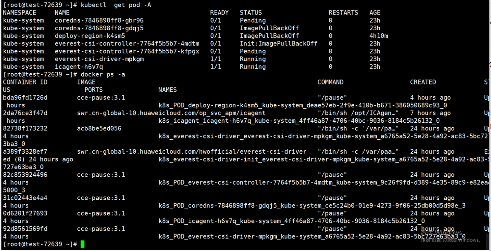
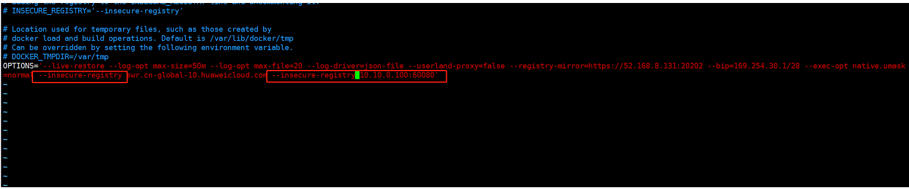

---
kind:
  - Troubleshooting
products:
  - Alauda Container Platform
  - Alauda DevOps
  - Alauda AI
  - Alauda Application Services
  - Alauda Service Mesh
  - Alauda Developer Portal
ProductsVersion:
  - 4.1.0,4.2.x
---
<!-- A type of document that involves encountering a fault, diagnosing it, performing root cause analysis, and providing solutions. -->

# 3.8

pod拉取镜像失败，镜像地址不是集群的60080地址 修改daemon.json后docker启动失败

## Cause
- daemon.json配置不生效
- 正确的镜像仓库地址未配置在/etc/sysconfig/docker/docker.service文件

## Resolution
- 在/etc/sysconfig/docker/docker.service文件中配置60080仓库地址

## [workaround]

## [Related Information]
**Screenshots**

- Environment: 3.8, CCE
- daemon.json
- /etc/sysconfig/docker/docker.service
- 60080
- Component: Docker
- Page ID: 115512040
- Original Title: 3.8-CCE接入拉取镜像失败
