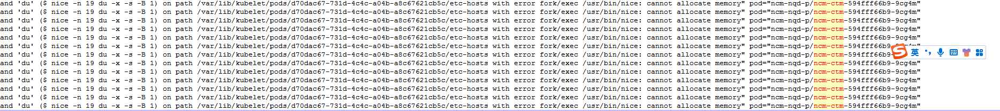

---kind:   - Troubleshootingproducts:    - Alauda Container Platform   - Alauda DevOps   - Alauda AI   - Alauda Application Services   - Alauda Service Mesh   - Alauda Developer PortalProductsVersion:   - 4.1.0,4.2.x---<!-- A type of document that involves encountering a fault, diag...it, performing root cause analysis, and providing solutions. --># fork/exec: cannot allocate memorykube-ovn-cni Probe 失败 ovs-vsctl 执行失败: fork/exec: cannot allocate memory docker 日志中 runc/docker-init 同样报错 fork/exec: cannot allocate memory## Cause- 节点进程/线程数达到上限- 业务应用线程泄露导致宿主机线程数过大## Resolution- 修复应用代码中的线程泄露问题- 限制容器资源使用（如线程数限制）- 加强线程数监控与告警## [workaround]## [Related Information]**Screenshots**- Environment: kube-ovn v1.7.3- ovs-vsctl- runc- docker-init- kube-ovn-cni- /usr/bin/ovs-vsctl- /usr/bin/runc- /usr/bin/docker-init- Component: Docker- Page ID: 115517464- Original Title: fork/exec: cannot allocate memory