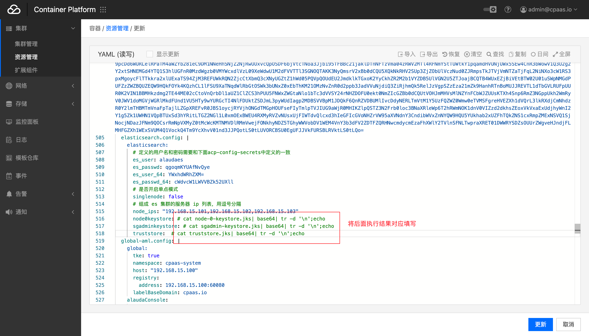

---
kind:
  - Troubleshooting
products:
  - Alauda Container Platform
  - Alauda DevOps
  - Alauda AI
  - Alauda Application Services
  - Alauda Service Mesh
  - Alauda Developer Portal
ProductsVersion:
  - 4.1.0,4.2.x
---
<!-- A type of document that involves encountering a fault, diagnosing it, performing root cause analysis, and providing solutions. -->

# elasticsearch证书到期续期

elasticsearch组件内SearchGuard证书（node-0-keystore.jks、sgadmin-keystore.jks）有效期过期

## Cause
- node-0-keystore.jks和sgadmin-keystore.jks证书有效期为2年到期

## Resolution
- 通过Dockerfile重建包含新证书的elasticsearch镜像并更新Deployment
- 通过修改sentry-cm配置同步新证书
- 直接更新cpaas-es-sg-certs secret中的base64编码证书

## [workaround]

## [Related Information]
**Screenshots**

- Environment: ACE2.7-TKE2.12等相关版本
- /usr/share/elasticsearch/config/truststore.jks
- /usr/share/elasticsearch/config/node-0-keystore.jks
- /usr/share/elasticsearch/plugins/search-guard-6/sgconfig/sgadmin-keystore.jks
- alauda_ts
- cpaas-es-sg-certs
- sentry-cm
- searchguard.ssl.transport.keystore_type
- searchguard.ssl.transport.truststore_type
- Component: Docker
- Page ID: 115521939
- Original Title: elasticsearch证书到期续期
