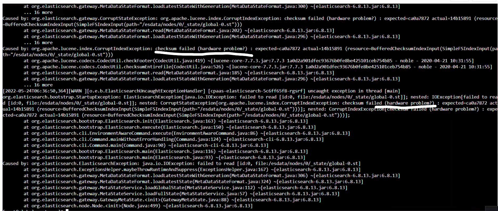

---
kind:
  - Troubleshooting
products:
  - Alauda Container Platform
  - Alauda DevOps
  - Alauda AI
  - Alauda Application Services
  - Alauda Service Mesh
  - Alauda Developer Portal
ProductsVersion:
  - 4.1.0,4.2.x
---
<!-- A type of document that involves encountering a fault, diagnosing it, performing root cause analysis, and providing solutions. -->

# elasticsearch报错checksum hardware problem?

elasticsearch pod crash状态不停的重启 报错内容为 checksum hardware problem

## Cause
- 磁盘RAM故障或磁盘坏道(但iaas侧检查未发现异常)

## Resolution
- 更换elasticsearch镜像为TKE 3.9的镜像
- 执行镜像更新命令：docker load -i es.tar && docker tag [es load出的镜像名] [镜像地址/es load镜像名] && docker push [es镜像名]
- 修改deployment配置：kubectl -n cpaas-system edit deploy cpaas-elasticsearch 修改spec.image字段
- 清空数据重启pod尝试恢复（若出现分片错误）

## [workaround]

## [Related Information]
**Screenshots**

- Environment: TKE 3.8.1
- /cpaas/data/elasticsearch,kafka,zookeeper
- cpaas-elasticsearch deployment
- loop0设备
- 镜像地址60080
- Component: Docker
- Page ID: 115525959
- Original Title: elasticsearch报错checksum hardware problem?
