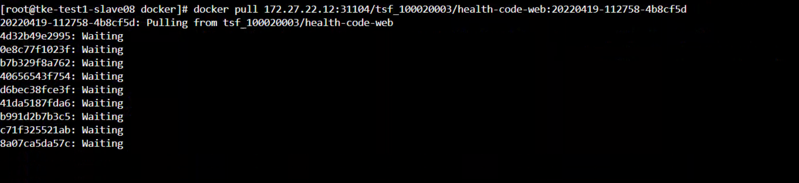
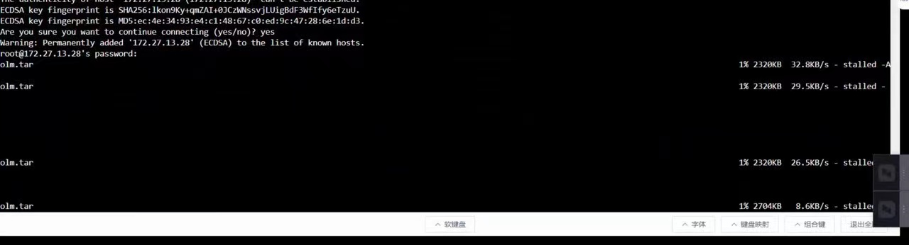

---
kind:
  - Troubleshooting
products:
  - Alauda Container Platform
  - Alauda DevOps
  - Alauda AI
  - Alauda Application Services
  - Alauda Service Mesh
  - Alauda Developer Portal
ProductsVersion:
  - 4.1.0,4.2.x
---
<!-- A type of document that involves encountering a fault, diagnosing it, performing root cause analysis, and providing solutions. -->

# docker pull镜像慢

imagePullBackOff docker pull速度慢（特定节点） 其他节点正常

## Cause
- 172.27.13.28节点与集群内其他节点的下行网络异常

## Resolution
- 检查/修复节点间网络质量（特别是下行带宽骤降问题）

## [workaround]

## [Related Information]
**Screenshots**

- Environment: 通用
- harbor
- docker
- docker0网桥
- iptables
- /var/lib/docker
- TKE 60080仓库
- Component: Docker
- Page ID: 115528119
- Original Title: docker pull镜像慢
