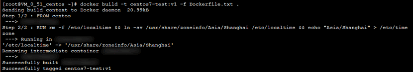
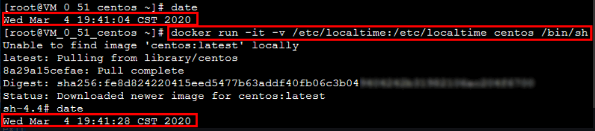

---
kind:
  - Troubleshooting
products:
  - Alauda Container Platform
  - Alauda DevOps
  - Alauda AI
  - Alauda Application Services
  - Alauda Service Mesh
  - Alauda Developer Portal
ProductsVersion:
  - 4.1.0,4.2.x
---
<!-- A type of document that involves encountering a fault, diagnosing it, performing root cause analysis, and providing solutions. -->

# 解决容器内时区不一致问题

容器内系统时间与节点本地时区相差8小时 日志记录和数据库存储时间不一致

## Cause
- 容器默认使用UTC时区
- 未配置本地时区(CST)

## Resolution
- 在Dockerfile中执行：RUN rm -f /etc/localtime && ln -sv /usr/share/zoneinfo/Asia/Shanghai /etc/localtime && echo "Asia/Shanghai" > /etc/timezone
- 使用修改后的Dockerfile构建新镜像：docker build -t centos7-test:v1 -f Dockerfile.txt .

## [workaround]

## [Related Information]
**Screenshots**
返回结果如下图所示：
6. 
- Environment: Kubernetes集群中的Docker容器
- /etc/localtime
- /etc/timezone
- /usr/share/zoneinfo/Asia/Shanghai
- Dockerfile配置
- Component: Docker
- Page ID: 115528550
- Original Title: 解决容器内时区不一致问题-Dockerfile 中创建时区文件解决
