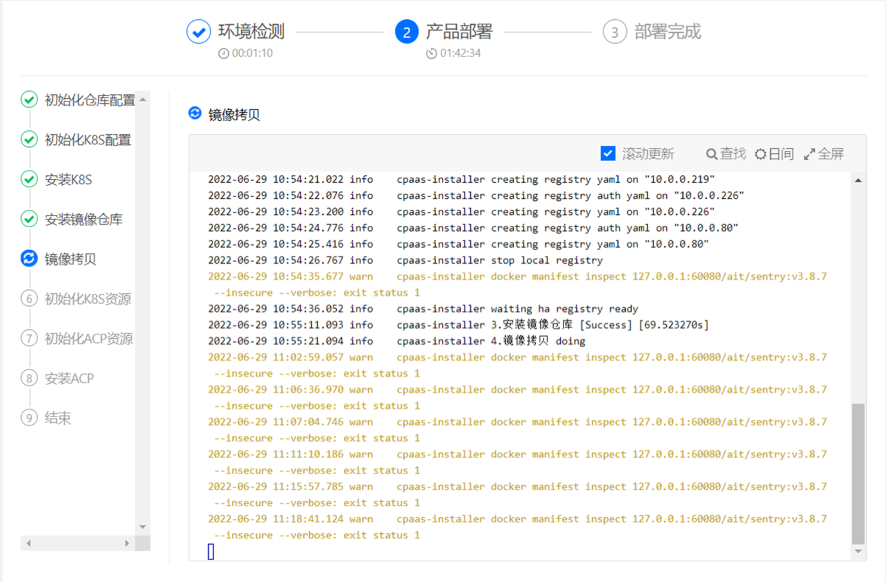
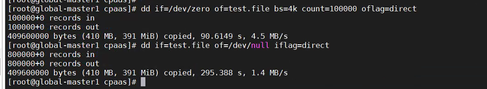

---
kind:
  - Troubleshooting
products:
  - Alauda Container Platform
  - Alauda DevOps
  - Alauda AI
  - Alauda Application Services
  - Alauda Service Mesh
  - Alauda Developer Portal
ProductsVersion:
  - 4.1.0,4.2.x
---
<!-- A type of document that involves encountering a fault, diagnosing it, performing root cause analysis, and providing solutions. -->

# 3.8.1

部署TKE平台卡在镜像拷贝步骤 mctmp容器日志停止刷新 磁盘IO性能低下

## Cause
- 磁盘IO性能问题导致镜像拷贝进程阻塞

## Resolution
- 在三个节点执行docker restart重启minio容器
- 持续观察mctmp容器日志直至镜像拷贝完成

## [workaround]

## [Related Information]
**Screenshots**

- mctmp容器
- minio容器
- docker ps -a | grep mctmp
- docker restart
- Component: Docker
- Page ID: 119086302
- Original Title: 3.8.1-部署TKE平台卡在镜像拷贝步骤
