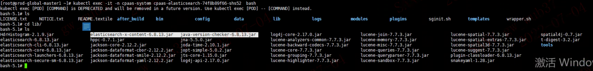
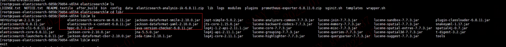

---
kind:
  - Troubleshooting
products:
  - Alauda Container Platform
  - Alauda DevOps
  - Alauda AI
  - Alauda Application Services
  - Alauda Service Mesh
  - Alauda Developer Portal
ProductsVersion:
  - 4.1.0,4.2.x
---
<!-- A type of document that involves encountering a fault, diagnosing it, performing root cause analysis, and providing solutions. -->

# ES节点加入集群失败，报错版本不匹配

ES容器启动失败，报错版本不匹配: index version 6.8.13与node version 6.8.11不兼容

## Cause
- log4j修复镜像中的ES jar包版本(6.8.13)与原镜像版本(6.8.11)不一致

## Resolution
- 将所有ES节点镜像替换为修复后的6.8.13版本镜像

## [workaround]

## [Related Information]
**Screenshots**

- Environment: 3.4.1
- ES 6.8.11
- ES 6.8.13
- log4j修复镜像
- audit-20220424索引
- /2cZDxBcRSMOXXUadiwplzg
- Component: Docker
- Page ID: 119088865
- Original Title: ES节点加入集群失败，报错版本不匹配
