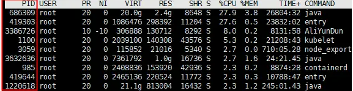
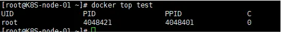

---
kind:
  - Troubleshooting
products:
  - Alauda Container Platform
  - Alauda DevOps
  - Alauda AI
  - Alauda Application Services
  - Alauda Service Mesh
  - Alauda Developer Portal
ProductsVersion:
  - 4.1.0,4.2.x
---
<!-- A type of document that involves encountering a fault, diagnosing it, performing root cause analysis, and providing solutions. -->

# 通过进程pid定位所属容器

无法快速确定高占用资源进程所属容器

## Cause
- 容器数量过多导致手动排查效率低下

## Resolution
- 使用 `docker top 容器名或容器ID` 命令对比进程PID
- 执行自动化查找脚本: 
#!/bin/bash
#将需要查找的pid输入$1变量
#将所有容器的pid导入变量a ，或将a直接定位为需要查找的进程pid
a=`docker ps -a |sed -n '1!p'|awk '{print $1}'`
#将容器id循环导入docker top命令，查找容器对应的pid
for b in $a
do
c=`docker top $b|sed -n '1!p'|awk '{print $2}'`
#经每一个容器的pid与输入$1对比
if [ $c == $1 ] ; then
#输出对应$1的容器信息
docker ps -a |grep $c
fi
done

## [workaround]

## [Related Information]
**Screenshots**

- Environment: docker
- docker top
- docker ps
- 容器ID
- 进程PID
- Component: Docker
- Page ID: 120119482
- Original Title: 通过进程pid定位所属容器
