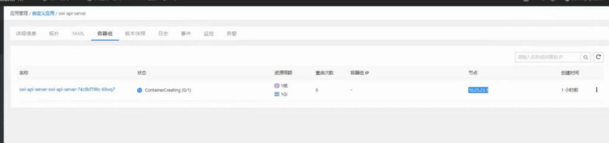
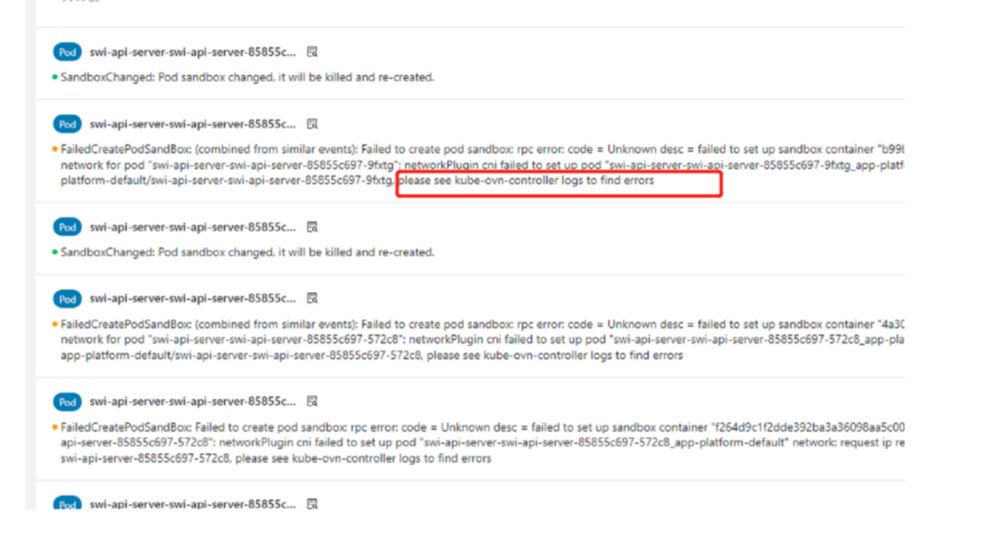
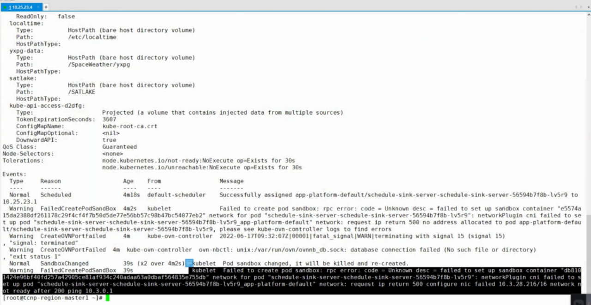
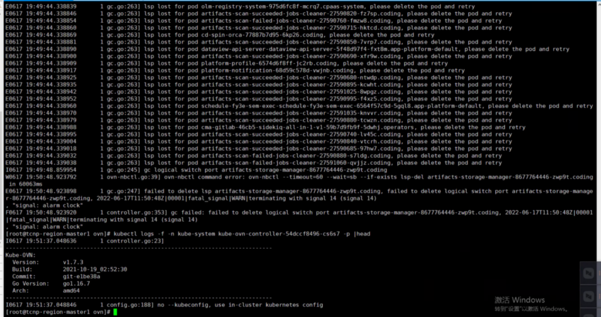
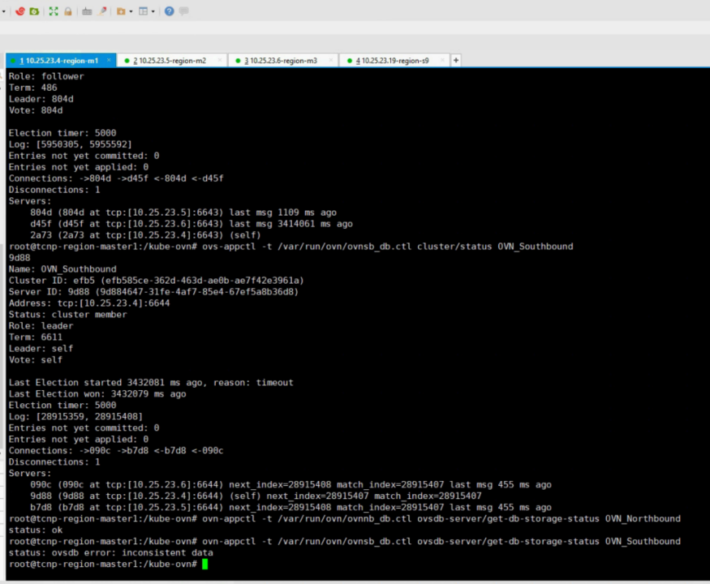
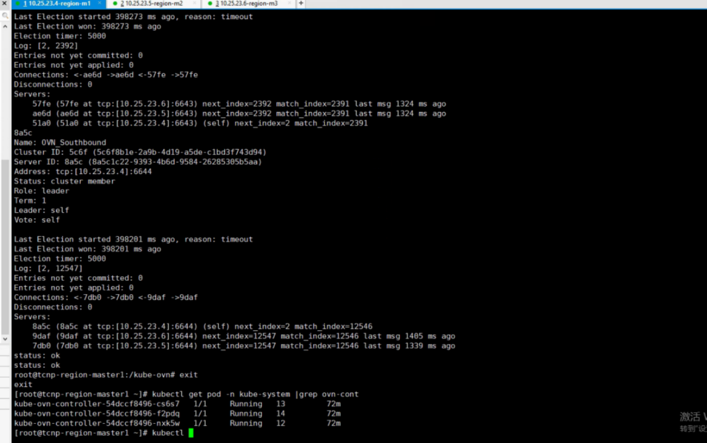
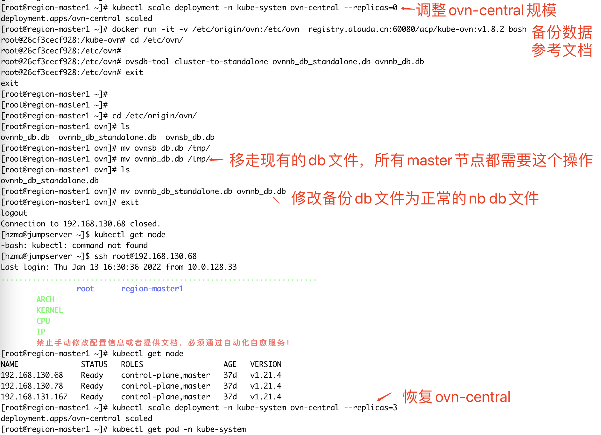
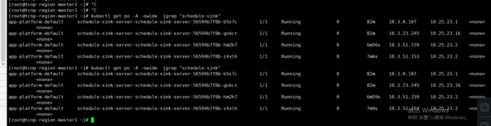

---
kind:
  - Troubleshooting
products:
  - Alauda Container Platform
  - Alauda DevOps
  - Alauda AI
  - Alauda Application Services
  - Alauda Service Mesh
  - Alauda Developer Portal
ProductsVersion:
  - 4.1.0,4.2.x
---
<!-- A type of document that involves encountering a fault, diagnosing it, performing root cause analysis, and providing solutions. -->

# SB DB 数据不一致，导致pod创建一直失败

应用容器无法创建成功，报错ovn网络插件异常，无法分配ip ovn-controller一直重启，日志报错逻辑路由表存在问题 sb数据库存在异常

## Cause
- ovn 1.7版本存在bug，当系统异常重启或根分区满时会导致ovn-central容器异常
- ovn-central数据库集群状态异常导致IP分配失败

## Resolution
- 执行自动恢复数据库脚本：kubectl scale deployment -n kube-system ovn-central --replicas=0
- 使用docker运行工具转换数据库：docker run -it -v /etc/origin/ovn:/etc/ovn registry.alauda.cn:60080/acp/kube-ovn:v1.8.2 bash
- 执行数据库转换命令：ovsdb-tool cluster-to-standalone ovnnb_db_standalone.db ovnnb_db.db
- 备份并重命名数据库文件：mv ovnsb_db.db /tmp/ && mv ovnnb_db.db /tmp/ && mv ovnnb_db_standalone.db ovnnb_db.db
- 恢复ovn-central部署：kubectl scale deployment -n kube-system ovn-central --replicas=3

## [workaround]

## [Related Information]
**Screenshots**

- Environment: 平台版本3.6.x，ovn版本1.7.3
- ovn-controller
- ovn-central
- sb数据库
- /var/run/ovn/ovnnb_db.ctl
- /var/run/ovn/ovnsb_db.ctl
- ovsdb-tool
- kubectl scale deployment
- Component: Docker
- Page ID: 127404098
- Original Title: SB DB 数据不一致，导致pod创建一直失败
