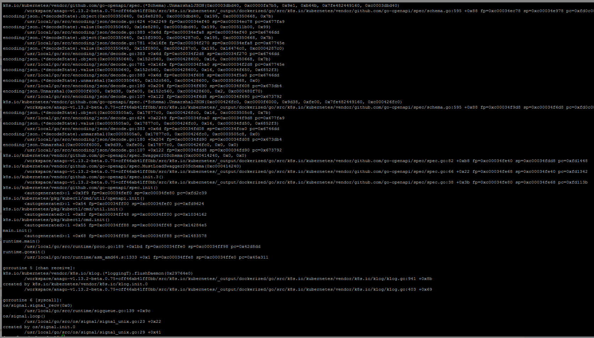
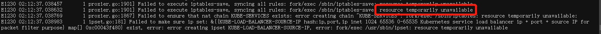
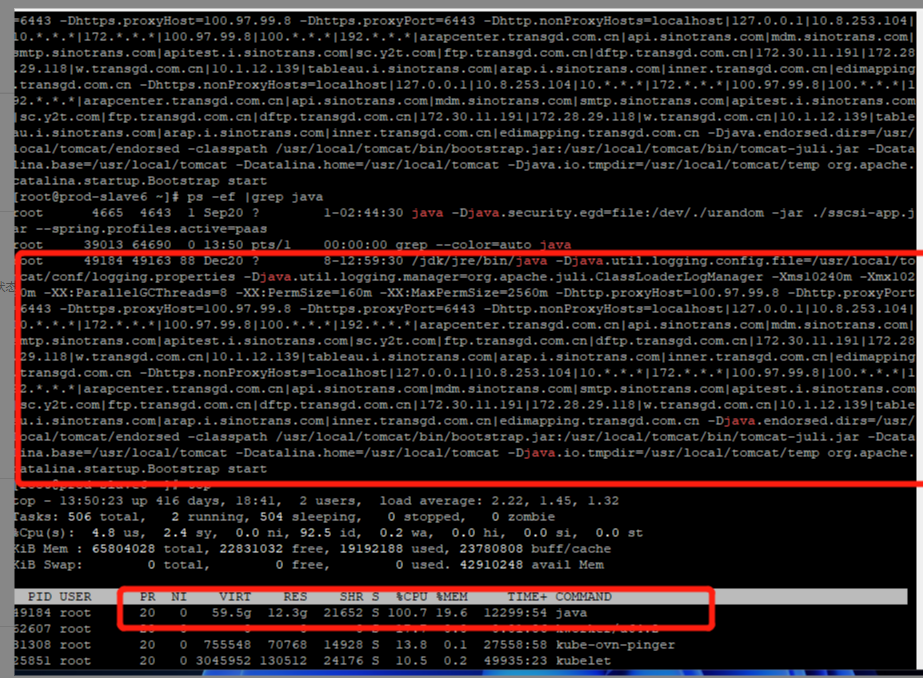

---
kind:
  - Troubleshooting
products:
  - Alauda Container Platform
  - Alauda DevOps
  - Alauda AI
  - Alauda Application Services
  - Alauda Service Mesh
  - Alauda Developer Portal
ProductsVersion:
  - 4.1.0,4.2.x
---
<!-- A type of document that involves encountering a fault, diagnosing it, performing root cause analysis, and providing solutions. -->

# ovn

ovn-cni容器异常无法启动 节点存在非平台相关的Java进程占用较多资源

## Cause
- 非平台相关的Java进程占用节点资源导致资源不足

## Resolution
- 执行 docker container prune -f 清理异常容器

## [workaround]

## [Related Information]
**Screenshots**

- Environment: 通用
- ovn-cni
- docker
- kubectl get pod
- Component: Docker
- Page ID: 133092163
- Original Title: ovn-cni容器异常无法启动-进程占用
