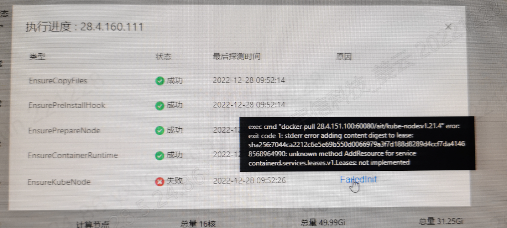
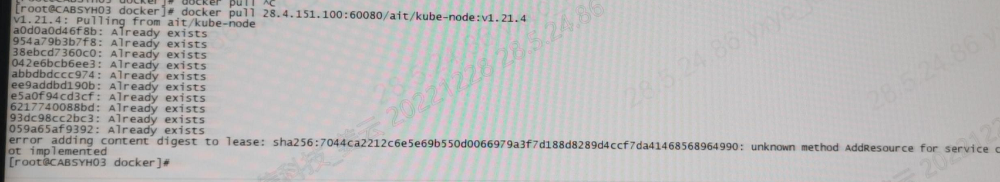

---
kind:
  - Troubleshooting
products:
  - Alauda Container Platform
  - Alauda DevOps
  - Alauda AI
  - Alauda Application Services
  - Alauda Service Mesh
  - Alauda Developer Portal
ProductsVersion:
  - 4.1.0,4.2.x
---
<!-- A type of document that involves encountering a fault, diagnosing it, performing root cause analysis, and providing solutions. -->

# 3.6.2

exec cmd "docker pull 28.4.151.100:60080/ait/kube-nodev1.21.4" error: exit code 1 stderr error adding content digest to lease:sha256:7044ca2212c6e5e696550d0066979a37d188d8289d4cc7da41468568964990: unknown method AddResource for service containerd services.leases.vl.Leases: not implemented 手动拉取镜像失败

## Cause
- 节点添加前主机上残留未清理干净的docker组件

## Resolution
- 执行清理脚本清理残留组件后重新添加节点

## [workaround]
- sudo systemctl restart containerd.service
- sudo systemctl restart docker
- 删除该节点并重新添加

## [Related Information]
**Screenshots**

- containerd
- docker
- 28.4.151.100:60080/ait/kube-nodev1.21.4
- containerd.service
- 清理脚本
- Component: Docker
- Page ID: 133094390
- Original Title: 3.6.2-业务集群添加节点失败
