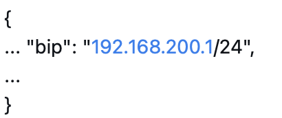
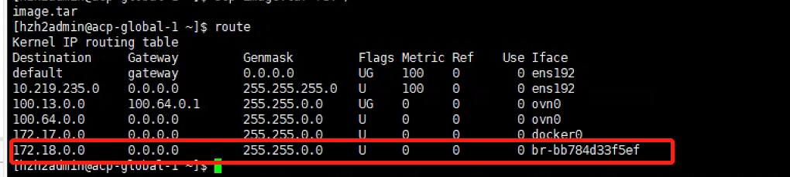
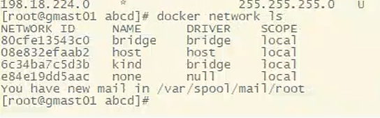
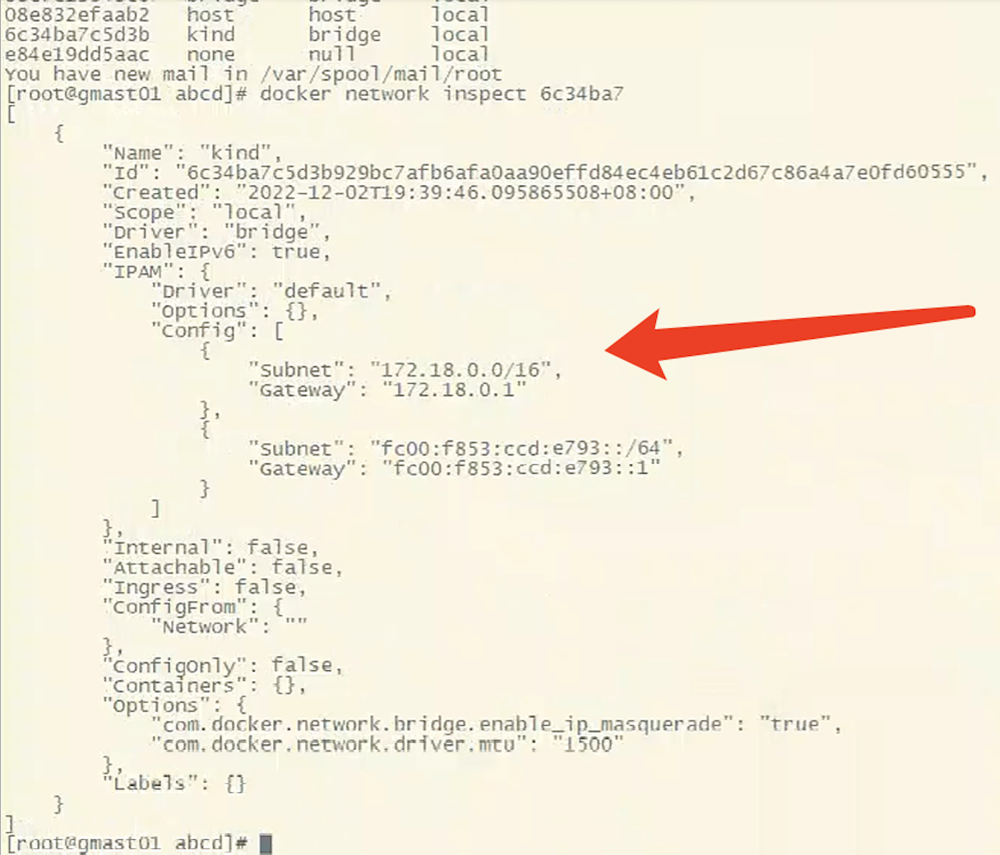

---
kind:
  - Troubleshooting
products:
  - Alauda Container Platform
  - Alauda DevOps
  - Alauda AI
  - Alauda Application Services
  - Alauda Service Mesh
  - Alauda Developer Portal
ProductsVersion:
  - 4.1.0,4.2.x
---
<!-- A type of document that involves encountering a fault, diagnosing it, performing root cause analysis, and providing solutions. -->

# docker网段与宿主机冲突

网络故障 存在172.18.0.0网段的异常路由

## Cause
- 名为kind的Docker网桥(172.18.0.0/16)与宿主机新网段172.0.0.0/8冲突

## Resolution
- 删除kind网桥: docker network rm <network-id>
- 重启docker服务: systemctl restart docker

## [workaround]

## [Related Information]
**Screenshots**

- Environment: TKE 3.10
- docker0
- br-网桥
- bip配置
- kind网桥
- Component: Docker
- Page ID: 136535490
- Original Title: docker网段与宿主机冲突
